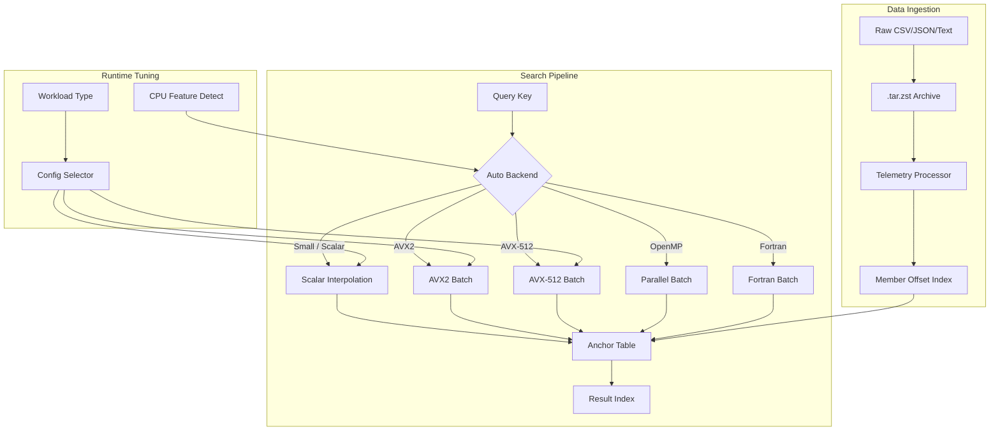
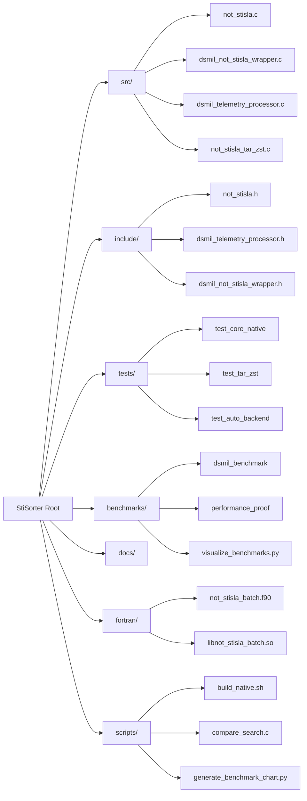
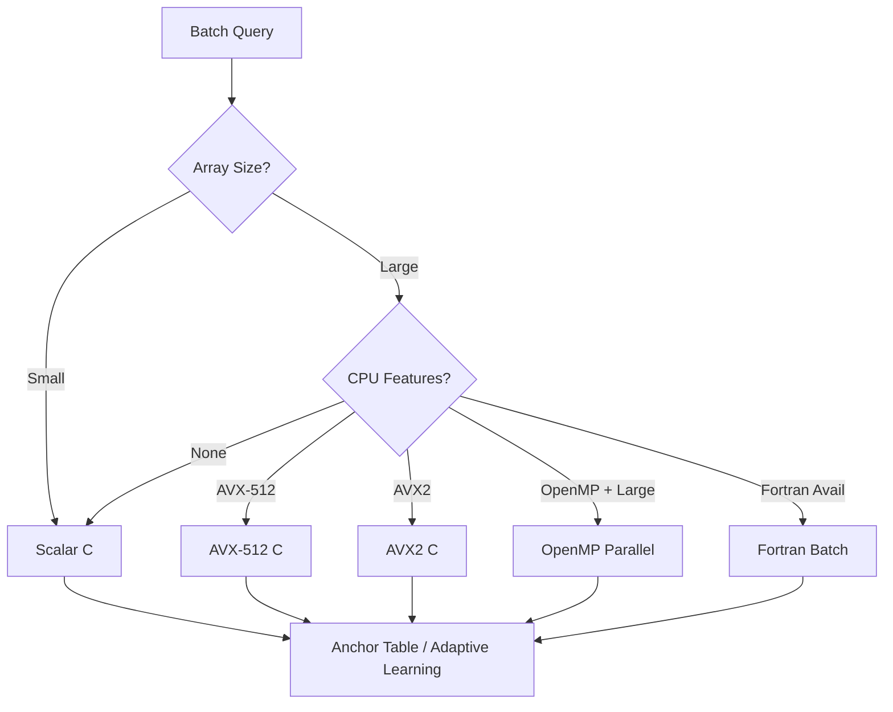

# StiSorter

[](https://en.wikipedia.org/wiki/C11_(C_standard_revision))
[](https://en.wikipedia.org/wiki/Fortran)
[](https://www.python.org/)
[](LICENSE)
[](https://www.kernel.org/)

High-performance interpolation search and batch lookup engine for sorted `int64_t` datasets. StiSorter combines anchor-guided interpolation search with runtime SIMD detection (AVX2 / AVX-512), OpenMP parallelism, an optional Fortran batch backend, and `.tar.zst` archive ingestion.

---

## Architecture



---

## Quick Start

### Build the Library

```bash
./build.sh
```

This produces `libstisorter.so` in the repository root with auto-detected AVX2/AVX-512, OpenMP, Fortran, and `tar.zst` support.

### Build Tests & Benchmarks

```bash
make clean && make all
```

### Run the Benchmark Suite

```bash
./benchmark.sh
```

Results are saved to:
- `benchmark_results.csv` — raw per-profile measurements
- `benchmark_comparison.png` — aggregated latency & speedup chart

### Run Tests

```bash
./bin/test_core_native
./bin/test_auto_backend
./bin/test_fortran_backend
./bin/test_telemetry_processor_perf
./bin/test_tar_zst
./bin/test_performance_fix
./bin/test_enhanced
```

---

## Project Layout



---

## Core API

### Single Search

```c
#include "not_stisla.h"

not_stisla_anchor_table_t* table = not_stisla_anchor_table_create();
not_stisla_result_t idx = not_stisla_search(data, n, key, table, 0);
if (idx != NOT_STISLA_NOT_FOUND) { /* found at idx */ }
not_stisla_anchor_table_destroy(table);
```

### Enhanced / Tuned Search

```c
not_stisla_config_t cfg;
not_stisla_config_init(&cfg, NOT_STISLA_WORKLOAD_TELEMETRY);
not_stisla_get_tuned_config(n, &cfg);

not_stisla_result_t idx = not_stisla_search_enhanced(data, n, key, table, &cfg);
```

### Batch Search

```c
not_stisla_batch_item_t batch[num_queries];
for (size_t i = 0; i < num_queries; ++i) batch[i].key = queries[i];

size_t found = not_stisla_search_batch(data, n, batch, num_queries, table, 8, NULL);
```

### Auto Backend Batch

```c
not_stisla_parallel_config_t pc = { .num_threads = 8, .batch_chunk = 256 };
size_t found = not_stisla_search_batch_auto(data, n, batch, num_queries, table, 8, &pc);
```

### tar.zst Archive Search

```c
#include "dsmil_not_stisla_wrapper.h"

dsmil_search_context_t* ctx = dsmil_search_create();
const char* members[] = {"telemetry.csv", "events.json"};
int ok = dsmil_search_batch_tar_zst(ctx, "data.tar.zst", members, 2, keys, num_keys, results);
dsmil_search_destroy(ctx);
```

---

## Backend Selection



---

## Feature Matrix

| Feature | C Scalar | C AVX2 | C AVX-512 | OpenMP | Fortran | tar.zst |
|---------|----------|--------|-----------|--------|---------|---------|
| Single search | ✅ | ✅ | ✅ | — | — | — |
| Batch search | ✅ | ✅ | ✅ | ✅ | ✅ | — |
| Auto backend | ✅ | ✅ | ✅ | ✅ | ✅ | — |
| Anchor learning | ✅ | ✅ | ✅ | ✅ | ✅ | — |
| Archive ingestion | — | — | — | — | — | ✅ |

---

## Benchmark Example

```bash
$ ./benchmark.sh
Running StiSorter benchmark suite...
Running profile: 100K_dense
Running profile: 1M_dense
Running profile: 1M_jitter
Running profile: 10M_dense
Generating benchmark_comparison.png...
Saved benchmark chart to: benchmark_comparison.png
```

Sample output chart (`benchmark_comparison.png`):
- **Left**: Average latency per backend (ns/op, log scale)
- **Right**: Average speedup vs binary search

---

## Environment Variables

| Variable | Default | Description |
|----------|---------|-------------|
| `NOT_STISLA_ENABLE_AVX2` | `auto` | Force-enable/disable AVX2 |
| `NOT_STISLA_ENABLE_AVX512` | `0` | Force-enable AVX-512 |
| `NOT_STISLA_ENABLE_OPENMP` | `1` | Enable OpenMP parallelism |
| `NOT_STISLA_ENABLE_FORTRAN` | `1` | Build/link Fortran backend |
| `NOT_STISLA_ENABLE_TAR_ZST` | `auto` | Enable tar.zst ingestion |
| `NOT_STISLA_FORCE_SCALAR` | `0` | Force scalar-only build |

---

## Requirements

- **Compiler**: GCC or Clang with C11 support
- **Optional**: `gfortran` (Fortran backend)
- **Optional**: `libarchive` + `libzstd` (tar.zst support)
- **Optional**: `pkg-config` (tar.zst auto-detection)
- **Python**: `numpy`, `matplotlib` (benchmark chart generation)

---

## License

**AGPL-3.0-or-later. This is strong copyleft. See [LICENSE](LICENSE) before any commercial use.**

This project is published as a technical showcase and for home deployment if you so wish, bear me in mind if you want a world class database driving your fancy new framework. Failure to comply will be treated as copyright infringement and pursued to the full extent of the law.


---

## Repository

[https://github.com/SWORDIntel/StiSorter](https://github.com/SWORDIntel/StiSorter)
