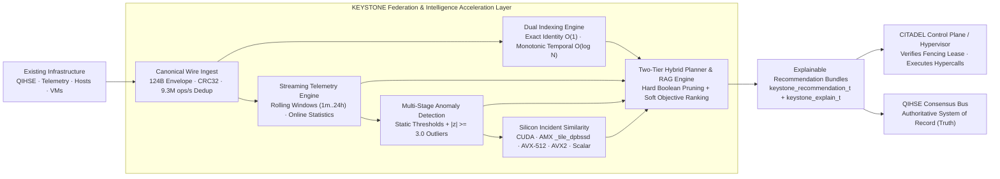

<p align="center">
  
</p>

# KEYSTONE

### Faster access to high-value records without replacing the systems that already store them.

[](https://en.wikipedia.org/wiki/C11_(C_standard_revision))
[](https://en.wikipedia.org/wiki/Advanced_Vector_Extensions)
[](https://www.openmp.org/)
[](https://www.kernel.org/)
[](LICENSE)
[](docs/architecture/federation_ingest.md)

**KEYSTONE is a high-performance indexing, ingestion, search, and intelligence acceleration engine for large-scale distributed systems.** It runs as a standalone acceleration layer, powers the [CITADEL OS](https://github.com/SWORDIntel/CITADEL) federation intelligence fabric, and feeds structured data directly into [QIHSE](https://github.com/SWORDIntel/QIHSE).

It is designed to make existing infrastructure work harder: eliminate search and triage bottlenecks, process multi-gigabyte streams without on-disk inflation, correlate telemetry across rolling windows, match historical failure patterns on target silicon (CUDA, Intel AMX, AVX-512, AVX2), and provide explainable decision evidence to hypervisor controllers.

> **Governing Architectural Principle:**  
> *"KEYSTONE may recommend, rank, correlate, predict, and accelerate. It must not silently become authoritative."*  
> QIHSE = truth / consensus / leases / fencing; KEYSTONE = acceleration / indexing / intelligence; CITADEL / Xen = policy & hypervisor execution.

**You do not have to adopt the whole stack.** KEYSTONE's search, ingestion, archive, trigram (`tgrep`), vector engine, and federation intelligence modules can be used independently where they make sense.

[Business benefits](#why-keystone) · [What it does](#what-keystone-does) · [How it fits](#how-it-fits) · [Measured results](#measured-results) · [Quick start](#quick-start) · [Technical docs](docs/README.md)

---

## Why KEYSTONE

Large data systems and cloud control planes often accumulate cost and latency in places that are difficult to see on a storage invoice: repeated lookup work, duplicated indexing logic, slow batch processing, underused CPU vector units, and expensive preprocessing before useful records can even be queried.

KEYSTONE targets that layer.

| Operational problem | KEYSTONE response |
|---|---|
| **Large datasets become slower and more expensive to search** | Adaptive indexed lookup and monotonic timeline indexing reduce retrieval time to sub-microsecond scales. |
| **Existing CPU & accelerator hardware is underused** | Runtime CPUID calibration dispatches execution across Scalar, SSE4.2, AVX2, AVX-512, Intel AMX (`_tile_dpbssd`), and NVIDIA CUDA. |
| **Autonomous schedulers make opaque or brittle decisions** | Two-tier hybrid planner separates non-negotiable hard constraints from soft objectives, emitting fully explainable recommendation bundles (`keystone_explain_t`). |
| **Raw, compressed, or dirty data takes too much preprocessing** | Ingestion pipelines stream `.tar.zst` archives with zero disk inflation, extract 24-bit inverted trigrams, and parse dirty tokens close to memory. |
| **Distributed nodes experience split-brain or stale writes** | Monotonic Hybrid Logical Clocks (HLC), fencing epoch verification, and deterministic conflict resolution (Epoch $\succ$ Generation $\succ$ HLC). |
| **Multi-tenant queries risk leaking metadata** | Mandatory Access Control (clearance levels and compartment masks) enforces zero metadata leakage (`KEYSTONED_STATUS_DENIED`). |
| **Replacing the primary database is too disruptive** | KEYSTONE sits beside existing systems (or QIHSE) as an evidence and indexing layer rather than requiring an all-or-nothing database migration. |

---

## What KEYSTONE Does

KEYSTONE combines focused capabilities behind one native library and modular daemon suite:

| Capability | Practical purpose |
|---|---|
| **Federation wire ingest & deduplication** | Packed 124-byte wire envelope with CRC32 integrity, 9.3M ops/sec deduplication ring, tombstone masking, and atomic checkpoint persistence. |
| **Exact identity directory** | $O(1)$ collision-safe open-addressing table mapping 128-bit UUIDs to active generation, epoch, and state at **4.6+ million queries/sec**. |
| **Monotonic temporal timeline** | Monotonic Hybrid Logical Clock (HLC) index with 64-byte cache-line aligned entries and binary range searches at **3.7+ million queries/sec**. |
| **Service daemon mode (`keystoned`)** | Standalone unprivileged daemon over `0700` Unix domain sockets with binary IPC, multi-client poll concurrency, and atomic generation pointer swapping. |
| **Security context partitioning** | Clearance levels (Unclassified to Top Secret) and 64-bit compartment bitmasks with zero metadata leakage. |
| **Topology graph cache** | Read-optimized in-memory graph cache (`RUNS_ON`, `ATTACHED_TO`, `DEPENDS_ON`, `SHARES_FAILURE_DOMAIN`) with neighborhood expansion and blast-radius tracing. |
| **Two-tier hybrid query planner** | Tier 1 boolean constraint pruning (security, CPU ISA, RAM, anti-affinity) and Tier 2 weighted soft ranking (RAM, CPU, thermals, NUMA). |
| **Streaming telemetry & anomalies** | Online Welford statistics over 1m/5m/15m/1h/24h rolling windows with static threshold alarms and $|z| \ge 3.0$ outlier detection. |
| **Silicon incident similarity** | 64-dim normalized failure embeddings with multi-tier silicon dispatch (CUDA, Intel AMX, AVX-512, AVX2, Scalar reference) for advisory mitigations. |
| **Federated query coordinator** | Multi-node registry, health monitoring, distributed conflict resolution, monotonic timeline multi-way merge, and partial-result resilience. |
| **Grounded AI/RAG context packs** | Constrained retrieval endpoint extracting citation-backed context packs (`keystone_context_pack_t`) with cryptographic model governance (SHA-256 validation). |
| **Trigram content indexing (`tgrep`)** | Inverted 24-bit direct directory text index delivering 100x+ sub-linear candidate rejection with parallel build and standalone CLI (`bin/tgrep`). |
| **Vector similarity engine** | LSH coarse indexing and SIMD distance kernels for 384-dim float32 embeddings with 8-level graceful fallback. |
| **Archive-aware processing** | High-throughput streaming and search over `.tar.zst` archives with persistent `.idx.json` sidecars and pipelined ring-buffer decompression. |

---

## How It Fits



The design is strictly database- and hypervisor-adjacent. KEYSTONE accelerates the path between high-volume telemetry and explainable decisions without becoming an unvetted execution authority.

For complete architectural specifications, see the [technical documentation](docs/README.md).

---

## Measured Results

Performance is continuously verified on target hardware:

### 1. Ingestion & Dual Indexing Performance (8-Core Host)
- **Federation Ingestion & Deduplication**: **9,345,794 events/sec** (107 ns/event) with 100% duplicate rejection and CRC32 verification.
- **Exact Identity Directory Lookup**: **4,608,294 lookups/sec** (217 ns/query) in $O(1)$ open-addressing table.
- **Monotonic Temporal Range Search**: **3,717,472 range queries/sec** (269 ns/query) with branchless binary bounding.

### 2. Algorithmic Key Search
On an **Intel Xeon E5-2407** (2.2GHz):
- Standard binary search (1M rows): 2,016,334 lookups/s (415 ns)
- **KEYSTONE anchor search (1M rows)**: **3,510,610 lookups/s (218 ns)** — **1.74× higher throughput, 47% lower latency**.

### 3. Vector Similarity Engine (384-dim Float32)
- **100,000 vectors (AVX + LSH)**: 423 queries/sec (2.36 ms/query) — **30.8× faster than NumPy brute force**.

### 4. Parallel Trigram Construction (1GB Text Corpus)
- **Parallel builder (`tgrep`)**: **22.31 seconds** vs 148.62 seconds single-threaded (**6.7× speedup**, 46 MB/s throughput, 957M postings).

---

## Current State

KEYSTONE is fully implemented with **19 / 19 passing test suites** (`make check`).

**All 8 CITADEL Federation Intelligence Upgrade phases are complete:**
- [x] **Phase 0**: Federation wire envelope, CRC32, 9.3M ops/sec dedup ring, tombstone registry, atomic checkpoints.
- [x] **Phase 1**: Exact identity directory ($O(1)$), monotonic HLC temporal timeline index ($O(\log N)$).
- [x] **Phase 2**: Security-aware native service daemon (`bin/keystoned`), restricted `0700` Unix socket, MAC clearance/compartment checks, atomic generation publication.
- [x] **Phase 3**: Topology graph cache (`RUNS_ON`, `DEPENDS_ON`, etc.), two-tier hybrid planner (Tier 1 boolean pruning, Tier 2 weighted soft ranking), explainable recommendation bundles.
- [x] **Phase 4**: Streaming telemetry ring buffers, rolling feature windows (1m..24h), online Welford statistics, multi-stage deterministic anomaly engine ($|z| \ge 3.0$).
- [x] **Phase 5**: 64-dim normalized incident vector embeddings, multi-tier silicon dispatch (NVIDIA CUDA, Intel AMX `_tile_dpbssd`, AVX-512, AVX2, Scalar CPU reference), advisory mitigations.
- [x] **Phase 6**: Federated distributed query coordinator, node health and latency tracking, conflict resolution (Epoch $\succ$ Generation $\succ$ HLC), multi-way monotonic merge, partial-result degradation.
- [x] **Phase 7**: Constrained AI/RAG context retrieval endpoint, explicit citations (`keystone_citation_t`), cryptographic model governance (SHA-256 weight validation).

See [`docs/STATUS_SUMMARY.md`](docs/STATUS_SUMMARY.md) and [`ROADMAP.md`](ROADMAP.md) for full details.

---

## Quick Start

### Build & Run Test Suite
```bash
git clone https://github.com/SWORDIntel/KEYSTONE.git
cd KEYSTONE
make clean
make check    # Runs all 19 test suites across core and federation modules
```

### Start `keystoned` Service Daemon
```bash
make bin/keystoned
bin/keystoned -s /run/keystone/keystoned.sock -d
```

### Fast Content Search with `tgrep`
```bash
make bin/tgrep
bin/tgrep -i -n "keystone_federation" src/ include/
```

### Run Benchmarks
```bash
make benchmarks
./benchmarks/dsmil_benchmark
./benchmarks/trigram_benchmark
```

For detailed build switches, see [`docs/BUILD_MODES.md`](docs/BUILD_MODES.md). For integration guidelines, see [`docs/INTEGRATION.md`](docs/INTEGRATION.md).

---

## Documentation Map

| Area | Documentation |
|---|---|
| **Overview & Map** | [`docs/README.md`](docs/README.md) |
| **Technical Overview** | [`docs/TECHNICAL_OVERVIEW.md`](docs/TECHNICAL_OVERVIEW.md) |
| **Status Summary** | [`docs/STATUS_SUMMARY.md`](docs/STATUS_SUMMARY.md) |
| **Build Modes** | [`docs/BUILD_MODES.md`](docs/BUILD_MODES.md) |
| **Integration Guide** | [`docs/INTEGRATION.md`](docs/INTEGRATION.md) |
| **Benchmark Results** | [`docs/BENCHMARK_RESULTS.md`](docs/BENCHMARK_RESULTS.md) |
| **Accelerator Contract** | [`docs/ACCELERATOR_CONTRACT.md`](docs/ACCELERATOR_CONTRACT.md) |
| **Federation Wire Ingest** | [`docs/architecture/federation_ingest.md`](docs/architecture/federation_ingest.md) |
| **Index Generations** | [`docs/architecture/index_generations.md`](docs/architecture/index_generations.md) |
| **Security Partitioning** | [`docs/architecture/security_partitioning.md`](docs/architecture/security_partitioning.md) |
| **Temporal Timeline** | [`docs/architecture/temporal_index.md`](docs/architecture/temporal_index.md) |
| **Exact & Temporal Co-Execution**| [`docs/architecture/exact_and_temporal_indexing.md`](docs/architecture/exact_and_temporal_indexing.md) |
| **Topology Graph Cache** | [`docs/architecture/topology_index.md`](docs/architecture/topology_index.md) |
| **Hybrid Query Planner** | [`docs/architecture/hybrid_query.md`](docs/architecture/hybrid_query.md) |
| **Recommendation Engine**| [`docs/architecture/recommendation_engine.md`](docs/architecture/recommendation_engine.md) |
| **Streaming Telemetry & Anomalies**| [`docs/architecture/telemetry_and_anomaly_engine.md`](docs/architecture/telemetry_and_anomaly_engine.md) |
| **Silicon & Incident Similarity** | [`docs/architecture/silicon_and_incident_similarity.md`](docs/architecture/silicon_and_incident_similarity.md) |
| **Federated Query Coordinator** | [`docs/architecture/federated_query_routing.md`](docs/architecture/federated_query_routing.md) |
| **AI/RAG Context & Governance** | [`docs/architecture/rag_context_and_model_governance.md`](docs/architecture/rag_context_and_model_governance.md) |
| **QIHSE Stream Contract** | [`docs/architecture/qihse_stream_contract.md`](docs/architecture/qihse_stream_contract.md) |
| **`keystoned` Daemon** | [`docs/architecture/keystoned.md`](docs/architecture/keystoned.md) |

---

## What KEYSTONE Is Not

KEYSTONE is not:
- an authoritative consensus cluster (that is QIHSE);
- a hypervisor controller or hypercall dispatcher (that is CITADEL / Xen);
- an ORM or generic dashboard platform.

It supplies fast, bounded, explainable evidence and intelligence to components that own those responsibilities.

---

## License

**AGPL-3.0-or-later.** See [LICENSE](LICENSE) before use, modification, redistribution, hosting, or derivative work.

Commercial, proprietary, or hosted use that is incompatible with AGPL obligations requires separate permission or licensing from the repository owner.

---

<div align="center">

**KEYSTONE**  
Fast retrieval. Silicon acceleration. Explainable intelligence.

</div>
