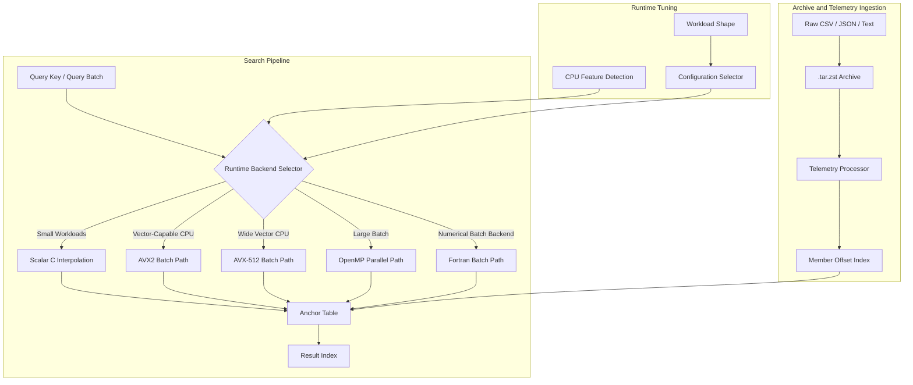
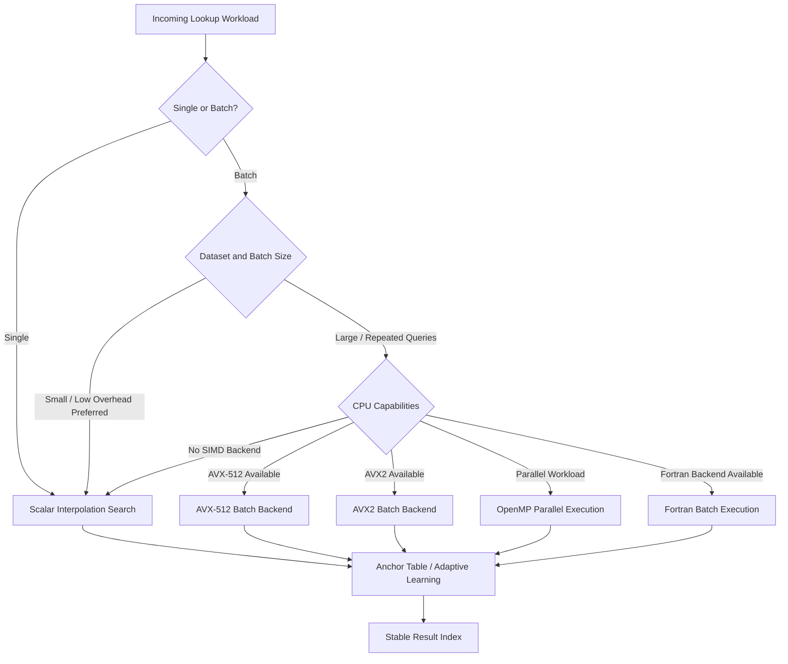
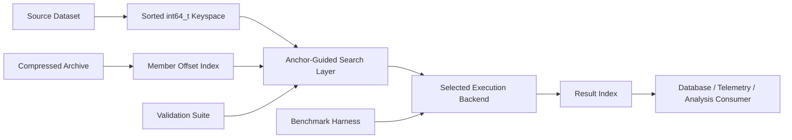
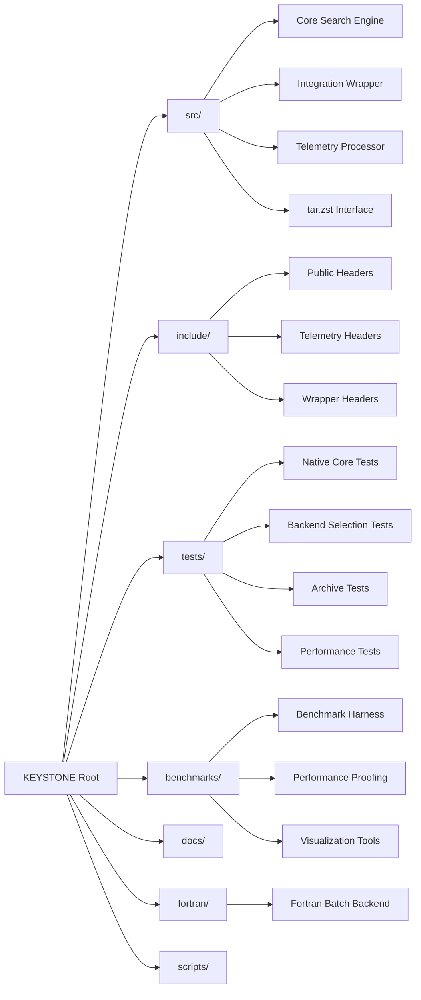

  

### KEYSTONE helps large databases find the right record fast — using adaptive search, CPU acceleration, and repeatable indexing logic.

)

**KEYSTONE** is a high-performance database indexing and lookup engine built for precise, repeatable retrieval over sorted 64-bit integer datasets.

It combines anchor-guided interpolation search, adaptive backend selection, SIMD acceleration, OpenMP parallelism, an optional Fortran batch engine, and compressed archive ingestion into a single practical system for serious data infrastructure.

---

## Mission

Modern databases rarely fail because storage is unavailable. They fail because lookup paths drift, records fragment, indexes become inconsistent, and high-volume datasets become expensive to search reliably.

KEYSTONE addresses that layer directly.

It is designed for systems where record identity, index stability, and lookup speed matter at the same time. Instead of treating indexing as a side effect of storage, KEYSTONE treats precise indexed retrieval as the core primitive.

---

## What KEYSTONE Is

KEYSTONE is a functional indexing and lookup engine for sorted `int64_t` datasets. It sits close to the data layer, supporting fast search, batch lookup, telemetry processing, archive-aware ingestion, and performance validation.

It is not a decorative wrapper around a database. It is a low-level search component designed for practical integration into larger systems that need predictable record access.

| Capability | Purpose |
|---|---|
| **Anchor-guided interpolation search** | Reduces search work by using learned anchor points across sorted data. |
| **Single-key lookup** | Supports precise direct search for individual records. |
| **Batch lookup** | Handles high-volume query workloads efficiently. |
| **Runtime backend selection** | Chooses the most appropriate search path based on CPU features and workload shape. |
| **SIMD acceleration** | Uses AVX2 and AVX-512 paths where available. |
| **OpenMP parallelism** | Scales batch workloads across CPU threads. |
| **Fortran batch backend** | Provides an optional high-throughput backend for numerical batch processing. |
| **`.tar.zst` ingestion** | Supports compressed archive workflows and member offset indexing. |
| **Benchmark suite** | Measures latency, throughput, and backend behavior across dataset profiles. |
| **Test coverage** | Validates native search, auto backend selection, Fortran support, telemetry processing, archive handling, performance fixes, and enhanced lookup behavior. |

---

## Why It Matters

High-speed lookup is easy to claim and difficult to prove. Real systems need more than a fast happy path.

KEYSTONE is built around the problems that appear when datasets become large, query volume increases, and records must remain stable across repeated processing runs.

It is useful where the cost of bad indexing is operationally significant:

- stale or unstable lookup positions;
- slow batch search over large sorted datasets;
- duplicated lookup logic across services;
- poor visibility into backend performance;
- inconsistent ingestion from compressed archives;
- weak testability around search behavior;
- performance claims without reproducible benchmarks.

KEYSTONE provides a focused answer: a compact, benchmarkable, database-adjacent indexing engine with multiple execution backends and a clear performance model.

---

## Architecture

---

## Backend Selection Model

---

## Data Flow

---

## System Profile

| Layer | Function |
|---|---|
| **Core search engine** | Performs anchor-guided interpolation search over sorted integer data. |
| **Adaptive backend layer** | Routes workloads across scalar, SIMD, OpenMP, and Fortran-capable paths. |
| **Anchor table** | Maintains learned search anchors to improve repeated lookup behavior. |
| **Batch processing layer** | Executes large query sets efficiently across available acceleration paths. |
| **Telemetry processor** | Supports structured ingestion and indexed lookup workflows for telemetry-style data. |
| **Archive interface** | Enables compressed `.tar.zst` workflows without treating archive handling as an afterthought. |
| **Benchmark harness** | Produces measurable performance evidence rather than vague speed claims. |
| **Validation suite** | Confirms core behavior, enhanced search, backend selection, archive support, and performance fixes. |

---

## Feature Matrix

| Feature | Scalar C | AVX2 | AVX-512 | OpenMP | Fortran | `.tar.zst` |
|---|---:|---:|---:|---:|---:|---:|
| Single search | Yes | Yes | Yes | No | No | No |
| Batch search | Yes | Yes | Yes | Yes | Yes | No |
| Auto backend selection | Yes | Yes | Yes | Yes | Yes | No |
| Anchor learning | Yes | Yes | Yes | Yes | Yes | No |
| Runtime tuning | Yes | Yes | Yes | Yes | Yes | No |
| Archive ingestion | No | No | No | No | No | Yes |
| Member offset indexing | No | No | No | No | No | Yes |
| Benchmark validation | Yes | Yes | Yes | Yes | Yes | Yes |
| Linux support | Yes | Yes | Yes | Yes | Yes | Yes |

---

## Practical Use Cases

### Database Index Acceleration

KEYSTONE is suitable for systems that need fast lookup across large sorted integer keyspaces, especially where keys map into record offsets, entity identifiers, telemetry IDs, event IDs, or compressed member indexes.

### Canonical Record Retrieval

When records are normalized into stable integer identifiers, KEYSTONE can act as the lookup layer that keeps retrieval fast and repeatable.

### Telemetry and Event Search

Telemetry systems often generate large ordered datasets that must be searched repeatedly. KEYSTONE is designed for that access pattern: high-volume lookup, repeatable index resolution, and measurable backend performance.

### Archive-Aware Data Processing

Compressed archive workflows are common in telemetry, exports, backups, and evidence packages. KEYSTONE includes `.tar.zst` ingestion support so archive processing can remain close to the indexed lookup model.

### Benchmark-Driven Optimization

The project includes performance tooling intended to compare backend behavior across dense, large, and jittered dataset profiles. This makes it suitable as both functional software and a performance engineering showcase.

### Systems Programming Demonstration

KEYSTONE demonstrates practical low-level engineering across C11, optional Fortran, Python-based benchmark visualization, SIMD-aware execution, OpenMP parallelism, compressed archive ingestion, and structured validation.

---

## Performance Orientation

KEYSTONE is designed around a simple premise: search performance should be measurable, backend-aware, and reproducible.

The benchmark suite is intended to produce concrete latency and speedup comparisons across workload profiles, including dense datasets, larger million-scale datasets, jittered distributions, and backend-specific behavior.

| Performance Concern | KEYSTONE Response |
|---|---|
| **Small lookup overhead** | Scalar interpolation remains available where vector or parallel overhead would be wasteful. |
| **Large batch volume** | SIMD, OpenMP, and Fortran paths provide acceleration options for heavier workloads. |
| **CPU variability** | Runtime feature detection supports backend selection based on available hardware. |
| **Repeated lookup behavior** | Anchor learning helps reduce repeated search cost across sorted keyspaces. |
| **Benchmark credibility** | Dedicated benchmark outputs support reviewable performance claims. |

---

## Repository Structure

---

## Technical Showcase Value

KEYSTONE is intended to be read as serious software, not a throwaway benchmark experiment.

It showcases:

- low-level search engine design;
- deterministic lookup over sorted 64-bit keyspaces;
- adaptive backend dispatch;
- SIMD-aware systems programming;
- OpenMP batch parallelism;
- optional Fortran integration;
- compressed archive ingestion;
- telemetry-oriented data handling;
- benchmark-driven engineering;
- testable performance claims;
- practical database-adjacent design.

This makes it suitable for portfolio review, technical demonstration, internal tooling, research infrastructure, and performance-sensitive database support work.

---

## Intended Users

KEYSTONE is intended for technical users who care about lookup correctness, runtime behavior, and database-adjacent performance.

| User Type | Why It Fits |
|---|---|
| **Database engineers** | Useful for fast lookup layers and stable integer keyspaces. |
| **Systems programmers** | Demonstrates C11, SIMD, OpenMP, Fortran integration, and archive handling. |
| **Security researchers** | Useful for telemetry, indicator stores, evidence indexes, and high-volume lookup datasets. |
| **Data engineers** | Supports repeatable indexing before downstream processing or enrichment. |
| **Performance engineers** | Provides benchmarkable backend behavior across workload shapes. |
| **Research teams** | Works as a compact foundation for indexed retrieval experiments. |

---

## Quality Model

| Goal | Standard |
|---|---|
| **Correctness** | Lookup behavior should remain predictable across supported backends. |
| **Repeatability** | The same sorted dataset and key should resolve consistently. |
| **Performance visibility** | Backend performance should be measurable rather than assumed. |
| **Backend flexibility** | Scalar, SIMD, parallel, and Fortran paths should serve different workload profiles. |
| **Archive practicality** | Compressed ingestion should integrate with the lookup model rather than exist as a detached helper. |
| **Operational usefulness** | The system should be practical for real database, telemetry, and analysis workflows. |

---

## Requirements

| Area | Requirement |
|---|---|
| **Operating system** | Linux |
| **Primary compiler** | GCC or Clang with C11 support |
| **Optional numerical backend** | Fortran 90+ capable compiler |
| **Optional archive support** | `libarchive` and `libzstd` |
| **Optional build detection** | `pkg-config` |
| **Benchmark visualization** | Python 3 with numerical and plotting support |
| **Parallel acceleration** | OpenMP-capable compiler/runtime |
| **Vector acceleration** | AVX2 or AVX-512 capable CPU where available |

---

## Security and Data Handling

KEYSTONE is designed for datasets that may be operationally sensitive. Treat inputs, benchmark outputs, generated indexes, and archive contents according to the sensitivity of the source material.

Recommended handling posture:

- do not commit private datasets or generated operational indexes;
- keep production database credentials outside the repository;
- validate archive contents before processing untrusted inputs;
- separate benchmark datasets from real operational data;
- preserve audit trails where indexed records support legal, investigative, or high-trust decisions;
- treat indexing errors as data integrity failures, not cosmetic defects.

---

## What KEYSTONE Is Not

KEYSTONE is not a general spreadsheet sorter, dashboard framework, ORM, database replacement, or broad ETL platform.

It is a focused indexing and lookup component for sorted integer datasets. Its strength is precision, backend-aware performance, and suitability for integration into larger database and telemetry systems.

---

## Roadmap

Planned development areas:

- stronger benchmark reporting;
- richer backend comparison output;
- expanded archive ingestion profiles;
- improved telemetry processor documentation;
- additional workload profiles for sparse and skewed datasets;
- clearer integration guidance for database-backed systems;
- richer validation around index stability;
- packaging improvements;
- expanded platform notes;
- deeper documentation for anchor behavior and tuning.

---

## License

**AGPL-3.0-or-later. This is strong copyleft. See [LICENSE](LICENSE) before use, modification, redistribution, hosting, or derivative work.**

Network use, redistribution, modification, and derivative use carry obligations. Do not treat this repository as permissive code.

If your intended use is proprietary, closed-source, commercial, hosted, or otherwise incompatible with AGPL compliance, obtain written permission or a separate license from the repository owner first.

Unlicensed use outside the terms of the repository license is not authorized. Respect the license, attribute properly, and do not repackage the work as your own.

For commercial or proprietary licensing discussions, contact the repository owner.

---

**KEYSTONE**  
Precision indexing. Adaptive lookup. Database discipline.

