<!--
  SPDX-License-Identifier: AGPL-3.0-or-later
  Copyright (C) 2026 SWORDIntel. All rights reserved.
-->

# KEYSTONE Technical Overview

This document contains the comprehensive engineering and architectural details for the KEYSTONE engine. The root [README](../README.md) provides a high-level executive overview; this document describes the complete internal architecture across numeric search, vectorized trigram indexing, vector similarity, and the **CITADEL Federation Intelligence Upgrade**.

For focused architectural specifications, see the dedicated guides in [`docs/architecture/`](architecture/).

---

## 1. Unified System Architecture

KEYSTONE operates as a dual-engine high-performance indexing, retrieval, and intelligence platform:

```mermaid
flowchart TB
    subgraph Federation["CITADEL Federation Intelligence & Evidence Engine"]
        WIRE["Wire Ingest / QIHSE Stream"] --> ENV["Canonical Wire Envelope (124B, CRC32)"]
        ENV --> DEDUP["Deduplication Hash Ring (9.3M ops/s)"]
        DEDUP --> FENCE{"Fencing Epoch Check"}
        FENCE --> TOMB["Tombstone Registry"]
        FENCE --> EXACT["Exact Identity Directory O(1)"]
        FENCE --> TEMP["Monotonic Temporal Timeline O(log N)"]
        ENV --> TELEM["Streaming Telemetry Ring (1m..24h)"]
        TELEM --> ANOM["Multi-Stage Anomaly Engine (|z| >= 3.0)"]
        ANOM --> EMBED["64-dim Incident Vector Synthesis"]
        EMBED --> SILICON{"Silicon Dispatch (CUDA / AMX / AVX-512 / AVX2 / Scalar)"}
        SILICON --> SIM["Incident Similarity Search (Top-K)"]
        ENV --> TOPO["Topology Graph Cache (Adjacency & Metrics)"]
        TOPO --> PLAN["Two-Tier Hybrid Query Planner"]
        EXACT & TEMP & TELEM & ANOM & SIM & TOPO --> RAG["Grounded RAG Context Packs + Citations"]
        PLAN & SIM --> REC["Explainable Recommendation Bundles (keystone_recommendation_t)"]
    end

    subgraph CoreSearch["Core Algorithmic Search & Content Indexing"]
        RAW["Raw Data / Archives / Text"] --> TAR["Streaming .tar.zst Reader (Zero-Disk)"]
        RAW --> RADIX["Zero-Copy LSD Radix Sort"]
        RAW --> TRI["24-Bit Direct Trigram Directory (tgrep)"]
        TRI --> SIMD_INT["Adaptive SIMD & Galloping Intersection"]
        RAW --> VEC["LSH Vector Engine (384-dim float32)"]
        NUM["Sorted int64_t Keys"] --> AUTO{"Runtime Backend Calibrator"}
        AUTO --> SCALAR["Scalar C Reference"]
        AUTO --> OPT_C["Optimized C Batch"]
        AUTO --> OMP["OpenMP Parallel Batch"]
        AUTO --> FORT["Optional Fortran Scientific"]
    end

    subgraph ServiceMode["Service & IPC Layer"]
        DAEMON["bin/keystoned Service Daemon"] --> SOCK["Unix Domain Socket (/run/keystone/keystoned.sock, 0700)"]
        SOCK --> SEC{"Security Context Partitioning (MAC)"}
        SEC -->|Denied| DENY["KEYSTONED_STATUS_DENIED (Zero Leakage)"]
        SEC -->|Authorized| SWAP["Reader-Writer Atomic Generation State Swap"]
    end
```



---

## 2. CITADEL Federation Intelligence Architecture

Governed by [`CITADEL/docs/architecture/KEYSTONE_FEDERATION_INTELLIGENCE_UPGRADE_BRIEF.md`](../../../CITADEL/docs/architecture/KEYSTONE_FEDERATION_INTELLIGENCE_UPGRADE_BRIEF.md), KEYSTONE serves as the high-speed evidence, topology expansion, anomaly detection, and explainable decision-support accelerator for CITADEL and QIHSE.

### 2.1 The Cardinal Architectural Principle
> **"KEYSTONE may recommend, rank, correlate, predict, and accelerate. It must not silently become authoritative."**

```text
QIHSE                ==>  Consensus, Truth, Leases, Fencing Epochs
KEYSTONE             ==>  Evidence, Telemetry, Similarity, Recommendations
CITADEL Controller   ==>  Policy Validation, Hypervisor Control, Execution
```

- **QIHSE** is the authoritative system of record. It owns leases, fencing epochs, and state transitions.
- **KEYSTONE** ingests events, extracts features, indexes identities, and provides sub-millisecond retrieval without mutating cluster state.
- **CITADEL** consumes KEYSTONE's explainable recommendations and telemetry summaries, but verifies hard fencing epochs and executes hypervisor actions independently.

---

### 2.2 Subsystem Breakdown & Architecture Documents

| Subsystem | Specification Document | Implementation Headers & Source |
|---|---|---|
| **Federation Wire Ingest** | [`docs/architecture/federation_ingest.md`](architecture/federation_ingest.md) | [`include/keystone_federation.h`](file:///home/john/Documents/KEYSTONE/include/keystone_federation.h)<br>[`src/federation/keystone_federation_ingest.c`](file:///home/john/Documents/KEYSTONE/src/federation/keystone_federation_ingest.c) |
| **Index Generations** | [`docs/architecture/index_generations.md`](architecture/index_generations.md) | [`include/keystoned.h`](file:///home/john/Documents/KEYSTONE/include/keystoned.h)<br>[`src/service/keystoned_server.c`](file:///home/john/Documents/KEYSTONE/src/service/keystoned_server.c) |
| **Security Partitioning** | [`docs/architecture/security_partitioning.md`](architecture/security_partitioning.md) | [`include/keystoned.h`](file:///home/john/Documents/KEYSTONE/include/keystoned.h)<br>[`src/service/keystoned_server.c`](file:///home/john/Documents/KEYSTONE/src/service/keystoned_server.c) |
| **Exact Identity Directory** | [`docs/architecture/exact_and_temporal_indexing.md`](architecture/exact_and_temporal_indexing.md) | [`include/keystone_exact_index.h`](file:///home/john/Documents/KEYSTONE/include/keystone_exact_index.h)<br>[`src/federation/keystone_exact_index.c`](file:///home/john/Documents/KEYSTONE/src/federation/keystone_exact_index.c) |
| **Monotonic Temporal Index** | [`docs/architecture/temporal_index.md`](architecture/temporal_index.md) | [`include/keystone_temporal.h`](file:///home/john/Documents/KEYSTONE/include/keystone_temporal.h)<br>[`src/temporal/keystone_temporal_index.c`](file:///home/john/Documents/KEYSTONE/src/temporal/keystone_temporal_index.c) |
| **Native Service Daemon (`keystoned`)** | [`docs/architecture/keystoned.md`](architecture/keystoned.md) | `bin/keystoned`<br>[`src/service/keystoned_main.c`](file:///home/john/Documents/KEYSTONE/src/service/keystoned_main.c)<br>[`src/service/keystoned_client.c`](file:///home/john/Documents/KEYSTONE/src/service/keystoned_client.c) |
| **Topology Graph Cache** | [`docs/architecture/topology_index.md`](architecture/topology_index.md) | [`include/keystone_topology.h`](file:///home/john/Documents/KEYSTONE/include/keystone_topology.h)<br>[`src/topology/keystone_topology_index.c`](file:///home/john/Documents/KEYSTONE/src/topology/keystone_topology_index.c) |
| **Two-Tier Hybrid Planner** | [`docs/architecture/hybrid_query.md`](architecture/hybrid_query.md) | [`include/keystone_hybrid.h`](file:///home/john/Documents/KEYSTONE/include/keystone_hybrid.h)<br>[`src/query/keystone_hybrid_planner.c`](file:///home/john/Documents/KEYSTONE/src/query/keystone_hybrid_planner.c) |
| **Explainable Recommendations** | [`docs/architecture/recommendation_engine.md`](architecture/recommendation_engine.md) | [`include/keystone_federation.h`](file:///home/john/Documents/KEYSTONE/include/keystone_federation.h)<br>[`include/keystone_hybrid.h`](file:///home/john/Documents/KEYSTONE/include/keystone_hybrid.h) |
| **Streaming Telemetry & Anomalies** | [`docs/architecture/telemetry_and_anomaly_engine.md`](architecture/telemetry_and_anomaly_engine.md) | [`include/keystone_telemetry.h`](file:///home/john/Documents/KEYSTONE/include/keystone_telemetry.h)<br>[`src/telemetry/keystone_telemetry_engine.c`](file:///home/john/Documents/KEYSTONE/src/telemetry/keystone_telemetry_engine.c) |
| **Silicon Incident Similarity** | [`docs/architecture/silicon_and_incident_similarity.md`](architecture/silicon_and_incident_similarity.md) | [`include/keystone_incident.h`](file:///home/john/Documents/KEYSTONE/include/keystone_incident.h)<br>[`src/incident/keystone_incident_engine.c`](file:///home/john/Documents/KEYSTONE/src/incident/keystone_incident_engine.c) |
| **Federated Query Coordinator** | [`docs/architecture/federated_query_routing.md`](architecture/federated_query_routing.md) | [`include/keystone_federated_query.h`](file:///home/john/Documents/KEYSTONE/include/keystone_federated_query.h)<br>[`src/federation/keystone_federated_query.c`](file:///home/john/Documents/KEYSTONE/src/federation/keystone_federated_query.c) |
| **Grounded AI/RAG Context** | [`docs/architecture/rag_context_and_model_governance.md`](architecture/rag_context_and_model_governance.md) | [`include/keystone_rag.h`](file:///home/john/Documents/KEYSTONE/include/keystone_rag.h)<br>[`src/query/keystone_rag_engine.c`](file:///home/john/Documents/KEYSTONE/src/query/keystone_rag_engine.c) |
| **QIHSE Stream Contract** | [`docs/architecture/qihse_stream_contract.md`](architecture/qihse_stream_contract.md) | [`include/keystone_fabric.h`](file:///home/john/Documents/KEYSTONE/include/keystone_fabric.h)<br>[`src/keystone_fabric.c`](file:///home/john/Documents/KEYSTONE/src/keystone_fabric.c) |

---

## 3. Core Algorithmic Search Model

KEYSTONE's primary numeric search surface operates on sorted `int64_t` keyspaces. Anchor points provide learned/local guidance into the sorted domain and scalar interpolation resolves candidate regions. Small local windows use architecture-specific scan implementations when the build and runtime CPU support them.

The implementation retains a strict scalar reference path so optimized backends can be checked against identical lookup semantics.

### 3.1 CPU Execution Paths
- Scalar C reference/anchor search (`keystone_search_scalar`);
- Optimized C merge-walk batch path (`keystone_search_batch_c`);
- SSE4.2 local scan (`_mm_cmpeq_epi64`, 2x unrolled);
- AVX2 local scan on supported x86 builds;
- Build-gated AVX-512 local scan (`keystone_avx512.c`);
- OpenMP multi-threaded batch execution (`keystone_search_batch_openmp`);
- Optional Fortran batch backend (`fortran/keystone_batch.f90`).

### 3.2 Runtime Calibration & Backend Selection
`keystone_search_batch_auto()` benchmarks candidate batch backends on first encounter rather than assuming a static backend is optimal for every machine:

```c
typedef struct {
    keystone_backend_t backend;
    keystone_backend_decision_source_t source; /* FAST_PATH, MEASURED, CACHE, STATIC_FALLBACK */
    keystone_query_shape_t shape;              /* GENERAL, DENSE_SORTED, SPARSE_SORTED, STRIDED, RANDOM */
    uint32_t hit_rate_pct;                     /* Observed in-bounds hit rate (0..100) */
    int64_t avg_gap;                           /* Average delta between adjacent query keys */
    int64_t detected_stride;                   /* Detected regular stride (or 0) */
    double median_ns_per_key;                  /* Measured latency */
    double p95_ns_per_key;                     /* Measured tail latency */
} keystone_backend_decision_t;
```

The calibration cache (`g_backend_cache`), synchronized via reader-writer locks (`pthread_rwlock_t`), eliminates lock contention across high-throughput worker threads.

---

## 4. Vectorized Trigram Indexing Engine (`bin/tgrep`)

KEYSTONE includes a native inverted trigram index (`include/keystone_trigram.h`, `src/keystone_trigram.c`) optimized for raw source code, log corpora, and binary triage:

1. **Direct 24-Bit Descriptor Directory**: Flat 64 MiB directory (`KEYSTONE_TRIGRAM_OPT_DIRECT_DIRECTORY`) mapping every 24-bit trigram directly to its posting slice, achieving $O(1)$ zero-probe trigram lookups without hash collisions or probing loops.
2. **SIMD Intersection & Monotonic Galloping**: Adaptive list intersection combining blocked AVX2 comparisons with monotonic galloping search (`ks_lower_bound_gallop_u32`), eliminating $O(N)$ restart penalties.
3. **Dense Posting Bitmaps**: High-frequency trigrams ($\ge \text{doc\_count} / 32$) are automatically converted to 64-bit word bitmaps at `finalize()`, intersected via $O(1)$ bit test and 64-bit word bitwise AND with `__builtin_ctzll`.
4. **Multi-Threaded Parallel Construction**: Two-pass parallel builder (`keystone_trigram_index_build_parallel`) achieving **6.7x speedup** on 1GB corpora (46 MB/s throughput, 957M postings).
5. **Standalone `bin/tgrep` CLI**: Full grep alternative supporting `-i` (case-folding), `-n` (line numbering), `-l` (files with matches), `-c` (count), `-j` (threads), and pre-built index caching (`-I` / `.tgrep.idx`).

---

## 5. Vector Similarity Engine (`vector_engine/`)

Optimized for 384-dimensional dense float32 embeddings (e.g., all-MiniLM-L6-v2, text-embedding-3-small) and arbitrary vector spaces:

- **Coarse Indexing via Locality-Sensitive Hashing (LSH)**: Random hyperplane projections, 4-way unrolled FMA projection dot products, 64-bit quick bloom filter candidate deduplication, and $O(N \log N)$ `qsort` bucket finalization.
- **Hierarchical SIMD & Silicon Acceleration**: Distance kernels for Cosine, Euclidean (L2), and Dot product across CUDA GPU, Myriad X VPU, AVX-512, AVX2/FMA, SSE4.2, ARM NEON, and Scalar fallback.
- **Zero-Heap Query Fast Paths**: Stack-allocated scratchpads for cosine query normalization (1,024 dims) and candidate reranking (512 candidates).

---

## 6. Comprehensive Feature Matrix

| Feature / Subsystem | Scalar Reference | AVX2 / SIMD | AVX-512 | AMX Matrix | CUDA GPU | OpenMP | Fortran | Service Mode (`keystoned`) |
|---|---|---|---|---|---|---|---|---|
| **Exact Identity Lookup** | $O(1)$ | SIMD hash check | N/A | N/A | N/A | Yes | N/A | IPC ($0700$ socket) |
| **Temporal Range Search** | Binary search | 128-bit UUID filter | N/A | N/A | N/A | Parallel merge | N/A | IPC range stream |
| **Numeric Key Search** | Interpolation | Local scan | Local scan | N/A | Batch binary | Multi-threaded | Numerical batch | Library call |
| **Trigram Content Search** | Reference loop | AVX2 intersection | N/A | N/A | N/A | Parallel build | N/A | CLI (`bin/tgrep`) |
| **Vector Similarity (384d)** | Reference dot | 8-wide FMA | 16-wide FMA | N/A | Batch distance | Multi-threaded | N/A | Library call |
| **Incident Similarity (64d)**| Reference dot | 8-wide FMA | 16-wide FMA | `_tile_dpbssd` | Batch distance | Multi-threaded | N/A | IPC incident query |
| **Topology Graph Cache** | Adjacency walk | N/A | N/A | N/A | N/A | Parallel query | N/A | IPC topology query |
| **Hybrid Two-Tier Planner** | Hard/Soft eval | N/A | N/A | N/A | N/A | Multi-candidate | N/A | IPC recommend query |
| **Telemetry & Anomalies** | Welford $z$-score | N/A | N/A | N/A | N/A | Multi-node | N/A | Real-time alerts |
| **Grounded RAG Retrieval** | Pack assembly | N/A | N/A | N/A | N/A | Parallel extract | N/A | IPC context pack |
| **Model Governance** | SHA-256 verify | SHA-NI accel | N/A | N/A | N/A | N/A | N/A | Manifest audit |

---

## 7. Concurrency, Memory & Security Guarantees

1. **Zero-Copy Radical Radix Sort**: 8-pass LSD radix sort (`src/dsmil_hash_indexer.c`) operates via double-buffered pointer ping-ponging, eliminating 32 full-array `memcpy` operations.
2. **Transparent Huge Pages**: `keystone_optimize_array_memory()` using `madvise(MADV_HUGEPAGE)` for arrays >1MB; zero major page faults up to 128M rows.
3. **Lock-Free Read Operations**: `pthread_rwlock_t` on calibration cache, topology index, and daemon generation state allows thousands of concurrent worker threads without lock contention.
4. **Zero Metadata Leakage**: Security context bitmask checks (`keystone_security_check`) deny unauthorized queries with empty payloads, ensuring callers cannot infer record existence.
5. **Atomic Generation Publication**: Pointer swaps allow offline index construction and instantaneous, zero-downtime activation.
