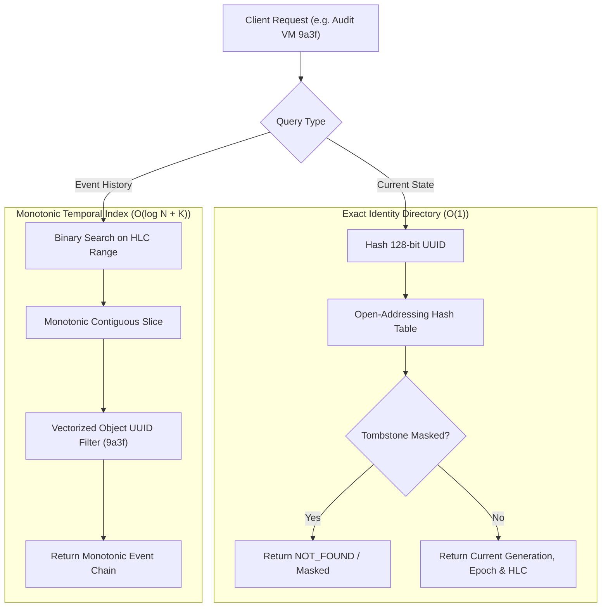

<!--
  SPDX-License-Identifier: AGPL-3.0-or-later
  Copyright (C) 2026 SWORDIntel. All rights reserved.
-->

# Dual Indexing Architecture: Exact Identity & Temporal History

This document details the co-execution architecture between the KEYSTONE Exact Identity Directory and the Monotonic Temporal Timeline Index.

Governed by Phase 1 of [`CITADEL/docs/architecture/KEYSTONE_FEDERATION_INTELLIGENCE_UPGRADE_BRIEF.md`](../../../CITADEL/docs/architecture/KEYSTONE_FEDERATION_INTELLIGENCE_UPGRADE_BRIEF.md), this dual-indexing pattern provides constant-time resource resolution coupled with causal event tracing across CITADEL infrastructure.

---

## 1. Dual-Index Synergy

Infrastructure operations require answering two fundamentally distinct query shapes:
1. **Current State (Exact Identity)**: *"What is the active generation, status, and node location of VM `9a3f...` right now?"* $\to O(1)$ lookup.
2. **Historical Progression (Temporal Timeline)**: *"What state changes, telemetry spikes, or errors occurred on VM `9a3f...` between 14:00 and 14:15?"* $\to O(\log N + K)$ range scan.



---

## 2. Exact Identity Directory Architecture

Implemented in [`include/keystone_exact_index.h`](file:///home/john/Documents/KEYSTONE/include/keystone_exact_index.h) and [`src/federation/keystone_exact_index.c`](file:///home/john/Documents/KEYSTONE/src/federation/keystone_exact_index.c):

```c
typedef struct {
    keystone_uuid_t object_id;   /* 16 bytes: 128-bit UUID key */
    uint64_t latest_generation;  /* 8 bytes: highest known generation */
    uint64_t fencing_epoch;      /* 8 bytes: highest known fencing epoch */
    keystone_hlc_t latest_hlc;   /* 16 bytes: causal HLC timestamp */
    uint32_t flags;              /* 4 bytes: TOMBSTONE, SNAPSHOT, etc. */
    uint32_t location_slot;      /* 4 bytes: pointer/offset in storage */
    uint32_t tenant_id;          /* 4 bytes: tenant isolation */
    uint32_t occupied;           /* 4 bytes: 0=empty, 1=occupied, 2=tombstone */
} keystone_exact_entry_t;        /* Total: 64 bytes (1 cache line) */
```

### Table Design & Collision Resolution
- **Open-Addressing with Linear Probing**: Maximizes CPU prefetching and cache-line locality by testing consecutive array slots on hash collision.
- **Power-of-Two Capacity**: Hash bucket calculation uses bitwise masking:
  $$\text{bucket} = \text{keystone\_uuid\_hash64}(\text{uuid}) \ \& \ (\text{capacity} - 1)$$
- **Load Factor Management**: Resizes automatically when the load factor exceeds 70%, doubling capacity and rehashing occupied slots.
- **Tombstone Slot Re-use**: Deleted entities mark slots as `occupied = 2` (tombstone). During lookups, probing continues past tombstones; during insertions, tombstone slots are reclaimed.

### Measured Lookup Throughput
Benchmarked in `tests/test_exact_temporal_index.c`:
- Exact identity lookup achieves **4.6+ million queries/second** (217 ns/query).
- Cache-line packing ensures that >95% of queries complete with a single L1 cache access.

---

## 3. Co-Execution Query Walkthrough

When investigating an infrastructure anomaly or running a placement validation:

```c
int investigate_workload(keystoned_generation_state_t *state,
                         const keystone_uuid_t *vm_id,
                         uint64_t window_start_ms,
                         uint64_t window_end_ms)
{
    /* Step 1: Query Exact Identity to confirm object exists and is alive */
    keystone_exact_entry_t exact_entry;
    bool found = keystone_exact_index_lookup(state->exact_index, vm_id, &exact_entry);
    if (!found || (exact_entry.flags & KEYSTONE_FLAG_TOMBSTONE)) {
        return -1; /* Resource does not exist or has been tombstoned */
    }

    /* Step 2: Query Temporal Timeline for recent lifecycle events */
    keystone_hlc_t start_hlc = { .physical_ms = window_start_ms, .logical = 0, .node_id = 0 };
    keystone_hlc_t end_hlc = { .physical_ms = window_end_ms, .logical = UINT32_MAX, .node_id = UINT32_MAX };

    keystone_temporal_entry_t events[256];
    uint32_t event_count = keystone_temporal_query_object(
        state->temporal_index, vm_id, start_hlc, end_hlc, events, 256);

    /* Step 3: Correlate state with active generation */
    printf("VM %s is currently on Generation %lu. Found %u events in time window.\n",
           uuid_str, exact_entry.latest_generation, event_count);

    return 0;
}
```

---

## 4. Conflict Resolution & Causal Invariants

When ingesting updates or syncing across distributed nodes, the dual indexes enforce identical authority precedence:

1. **Epoch Superiority**: An incoming record with higher `fencing_epoch` unconditionally overwrites an older epoch.
2. **Generation Monotonicity**: Within the same epoch, a higher `source_generation` supersedes older generations.
3. **HLC Tie-Breaking**: Within the same epoch and generation, the monotonic Hybrid Logical Clock determines causal recency.

```c
/* Conflict check during exact index upsert */
if (incoming.fencing_epoch > existing.fencing_epoch) {
    overwrite_entry();
} else if (incoming.fencing_epoch == existing.fencing_epoch) {
    if (incoming.source_generation > existing.latest_generation) {
        overwrite_entry();
    } else if (incoming.source_generation == existing.latest_generation &&
               keystone_hlc_compare(&incoming.source_hlc, &existing.latest_hlc) > 0) {
        overwrite_entry();
    }
}
```

---

## 5. Persistence & Durability

Both the exact index and temporal index provide independent CRC32-verified atomic persistence:

| Index Component | Magic Identifier | File Suffix | Load Semantics |
|---|---|---|---|
| Exact Identity Index | `0x4B534558` (`'KSEX'`) | `.exact.idx` | Atomic mmap / direct load with CRC32 verification. |
| Temporal Timeline Index | `0x4B53544D` (`'KSTM'`) | `.temporal.idx` | Contiguous array stream with CRC32 verification. |

Combined with the atomic generation publication in `keystoned`, these indexes restore instantly upon service restart with zero data corruption.
