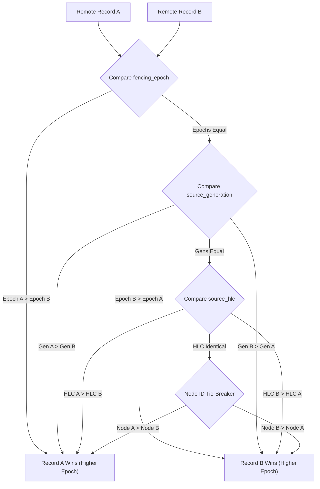

<!--
  SPDX-License-Identifier: AGPL-3.0-or-later
  Copyright (C) 2026 SWORDIntel. All rights reserved.
-->

# Federated Distributed Query & Routing Architecture

This document specifies the multi-node query coordinator, remote node health tracking, distributed conflict resolution, multi-way timeline merging, and partial-result degradation in KEYSTONE.

Governed by Phase 6 of [`CITADEL/docs/architecture/KEYSTONE_FEDERATION_INTELLIGENCE_UPGRADE_BRIEF.md`](../../../CITADEL/docs/architecture/KEYSTONE_FEDERATION_INTELLIGENCE_UPGRADE_BRIEF.md), the federated coordinator allows querying across geographically distributed indexer clusters while guaranteeing partition tolerance and causal consistency.

---

## 1. Federated Topology & Coordinator Overview

In multi-datacenter and edge deployments, each CITADEL site runs local KEYSTONE indexer instances. Rather than replicating raw event logs globally, queries are coordinated across sites.

```text
                               CITADEL Query Coordinator
                                          │
                  ┌───────────────────────┼───────────────────────┐
                  │ Fan-Out               │ Fan-Out               │ Fan-Out
                  ▼                       ▼                       ▼
          Site Alpha Indexer       Site Beta Indexer       Site Gamma Indexer
          (Local Exact/Timeline)   (Local Exact/Timeline)  (Local Exact/Timeline)
                  │                       │                       │
                  └───────────────────────┼───────────────────────┘
                                          │ Monotonic Multi-Way Merge
                                          ▼
                            Unified Monotonic Result Timeline
```

The coordinator manages:
- **Node Registry**: Remote indexer nodes, network addresses, latencies, and health states.
- **Conflict Resolution**: Deterministically resolves identity collisions across nodes.
- **Monotonic Multi-Way Merge**: Assembles timelines from multiple nodes into a single causal sequence.
- **Distributed Top-K Similarity**: Aggregates top-K incident similarity results across regions.
- **Partial-Result Degradation**: Returns partial data with explicit degradation flags if a remote node is unreachable or partitioned.

---

## 2. Remote Node Registry & Health Tracking

Defined in [`include/keystone_federated_query.h`](file:///home/john/Documents/KEYSTONE/include/keystone_federated_query.h):

```c
typedef enum {
    KEYSTONE_NODE_HEALTHY     = 0, /* Fully operational, responding within SLA */
    KEYSTONE_NODE_DEGRADED    = 1, /* Responding with high latency (>200ms) */
    KEYSTONE_NODE_UNREACHABLE = 2  /* Connection timeout or network partition */
} keystone_node_health_t;

typedef struct {
    uint32_t node_id;
    uint32_t site_id;
    char address[64];              /* Hostname or IP */
    uint16_t port;
    uint32_t latency_ms;           /* Exponential moving average latency */
    uint64_t last_seen_hlc;        /* Heartbeat causal timestamp */
    uint64_t active_generation;    /* Generation published by remote node */
    keystone_node_health_t health; /* Health state */
} keystone_remote_node_t;
```

Heartbeat probes continuously update `latency_ms` and `health`. If a node misses 3 consecutive heartbeats, its status transitions to `KEYSTONE_NODE_UNREACHABLE`.

---

## 3. Distributed Conflict Resolution

When multiple nodes report identity records for the same object UUID (e.g. during a split-brain recovery or cross-site migration), `keystone_federated_merge_exact_identity()` deterministically selects the authoritative entry:



This strict three-phase precedence (Epoch $\succ$ Generation $\succ$ HLC) guarantees that every node in the federation converges on identical state without split-brain inconsistencies.

---

## 4. Monotonic Multi-Way Timeline Merge

When executing a federated timeline range query across $M$ nodes, each node returns a slice of events sorted by HLC.

`keystone_federated_merge_timelines()` executes an $M$-way tournament merge (priority queue):
1. Initializes a min-heap with the head element from each node's result array.
2. Pops the minimum HLC entry from the heap and appends it to the output array.
3. Advances the stream that supplied the popped entry and pushes the next entry into the heap.
4. If an identical `event_id` is observed across streams (duplicate event), it is deduplicated idempotently.
5. Emits a strictly ascending timeline in $O(N \log M)$ time, where $N$ is total events and $M$ is node count.

---

## 5. Distributed Top-K Incident Similarity Merge

For incident investigations spanning multiple regions:
```c
int keystone_federated_merge_topk_incidents(
    const keystone_incident_record_t **node_results,
    const uint32_t *result_counts,
    uint32_t node_count,
    uint32_t k,
    keystone_incident_record_t *out_merged,
    uint32_t *out_merged_count);
```

- Collects regional top-K lists.
- Maintains a global min-heap of size $K$.
- Deduplicates matching incident UUIDs, retaining the highest confidence score.
- Returns the globally highest-ranking historical matches.

---

## 6. Partial-Result Status & Partition Resilience

In distributed infrastructure, network partitions or node crashes must never cause queries to fail entirely.

The coordinator returns results with an explicit [`keystone_partial_status_t`](file:///home/john/Documents/KEYSTONE/include/keystone_federated_query.h) flag:

```c
typedef enum {
    KEYSTONE_PARTIAL_COMPLETE    = 0, /* All registered nodes responded */
    KEYSTONE_PARTIAL_DEGRADED    = 1, /* Some degraded nodes responded slowly */
    KEYSTONE_PARTIAL_INCOMPLETE  = 2  /* One or more nodes partitioned/unreachable */
} keystone_partial_status_t;
```

If Site Gamma is unreachable:
- The coordinator merges results from Site Alpha and Site Beta.
- Returns the merged records with `partial_status = KEYSTONE_PARTIAL_INCOMPLETE`.
- Logs the unreachable nodes in the response header.
- The CITADEL control plane consumes the available evidence while remaining aware that regional data from Site Gamma is missing.
