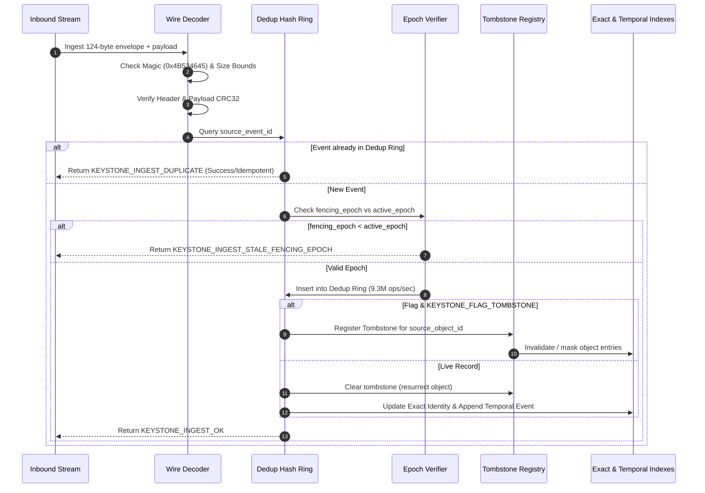

<!--
  SPDX-License-Identifier: AGPL-3.0-or-later
  Copyright (C) 2026 SWORDIntel. All rights reserved.
-->

# Federation Ingest Architecture

This document specifies the wire envelope, serialization mechanics, deduplication, tombstone handling, and atomic persistence of the KEYSTONE Federation Ingest subsystem.

Governed by [`CITADEL/docs/architecture/KEYSTONE_FEDERATION_INTELLIGENCE_UPGRADE_BRIEF.md`](../../../CITADEL/docs/architecture/KEYSTONE_FEDERATION_INTELLIGENCE_UPGRADE_BRIEF.md), KEYSTONE provides high-speed event ingestion, exact identity indexing, and monotonic temporal ordering for CITADEL and QIHSE without acting as the authoritative system of record.

---

## 1. Architectural Boundaries

KEYSTONE adheres to strict isolation invariants:

```text
+-----------------------+     +-------------------------------+     +---------------------------+
| QIHSE / Consensus Bus | --> | KEYSTONE Federation Ingest    | --> | CITADEL Control Plane     |
| (Source of Truth)     |     | (Evidence & Indexing Layer)   |     | (Policy & Action Executor)|
+-----------------------+     +-------------------------------+     +---------------------------+
  - Lease management            - Wire envelope validation            - Placement execution
  - Raft consensus              - 9.3M events/sec dedup ring          - VM lifecycle & fencing
  - Fencing epoch authority     - Exact & temporal indexing           - Non-authoritative advisory
  - Immutable event log         - Atomic checkpointing                - Never delegates truth
```

- **QIHSE** is the authoritative system of record. It owns leases, fencing epochs, and state transitions.
- **KEYSTONE** ingests events, extracts features, indexes identities, and provides sub-millisecond retrieval. It does not own or modify cluster state.
- **CITADEL** consumes KEYSTONE's explainable recommendations and telemetry summaries, but verifies hard fencing epochs and executes hypervisor actions independently.

---

## 2. Canonical Federation Wire Envelope

All events arriving from QIHSE or federated peer indexers are wrapped in a 124-byte packed binary wire format defined in [`include/keystone_federation.h`](file:///home/john/Documents/KEYSTONE/include/keystone_federation.h).

```text
 0                   1                   2                   3
 0 1 2 3 4 5 6 7 8 9 0 1 2 3 4 5 6 7 8 9 0 1 2 3 4 5 6 7 8 9 0 1
+-+-+-+-+-+-+-+-+-+-+-+-+-+-+-+-+-+-+-+-+-+-+-+-+-+-+-+-+-+-+-+-+
|                         Magic (0x4B534645)                    |
+-+-+-+-+-+-+-+-+-+-+-+-+-+-+-+-+-+-+-+-+-+-+-+-+-+-+-+-+-+-+-+-+
|        Wire Version           |          Header Size          |
+-+-+-+-+-+-+-+-+-+-+-+-+-+-+-+-+-+-+-+-+-+-+-+-+-+-+-+-+-+-+-+-+
|                          Header CRC32                         |
+-+-+-+-+-+-+-+-+-+-+-+-+-+-+-+-+-+-+-+-+-+-+-+-+-+-+-+-+-+-+-+-+
|                          Payload CRC32                        |
+-+-+-+-+-+-+-+-+-+-+-+-+-+-+-+-+-+-+-+-+-+-+-+-+-+-+-+-+-+-+-+-+
|                         Payload Length                        |
+-+-+-+-+-+-+-+-+-+-+-+-+-+-+-+-+-+-+-+-+-+-+-+-+-+-+-+-+-+-+-+-+
|                                                               |
+                 Source Object UUID (16 bytes)                 +
|                                                               |
+-+-+-+-+-+-+-+-+-+-+-+-+-+-+-+-+-+-+-+-+-+-+-+-+-+-+-+-+-+-+-+-+
|                                                               |
+                 Source Event UUID (16 bytes)                  +
|                                                               |
+-+-+-+-+-+-+-+-+-+-+-+-+-+-+-+-+-+-+-+-+-+-+-+-+-+-+-+-+-+-+-+-+
|                         Source Node ID                        |
+-+-+-+-+-+-+-+-+-+-+-+-+-+-+-+-+-+-+-+-+-+-+-+-+-+-+-+-+-+-+-+-+
|                    Source Generation (uint64)                 |
|                                                               |
+-+-+-+-+-+-+-+-+-+-+-+-+-+-+-+-+-+-+-+-+-+-+-+-+-+-+-+-+-+-+-+-+
|                     Fencing Epoch (uint64)                    |
|                                                               |
+-+-+-+-+-+-+-+-+-+-+-+-+-+-+-+-+-+-+-+-+-+-+-+-+-+-+-+-+-+-+-+-+
|                                                               |
+             Hybrid Logical Clock (HLC) (16 bytes)             +
|                                                               |
+-+-+-+-+-+-+-+-+-+-+-+-+-+-+-+-+-+-+-+-+-+-+-+-+-+-+-+-+-+-+-+-+
|                           Tenant ID                           |
+-+-+-+-+-+-+-+-+-+-+-+-+-+-+-+-+-+-+-+-+-+-+-+-+-+-+-+-+-+-+-+-+
|     Classification Level      |          Object Type          |
+-+-+-+-+-+-+-+-+-+-+-+-+-+-+-+-+-+-+-+-+-+-+-+-+-+-+-+-+-+-+-+-+
|                         Record Flags                          |
+-+-+-+-+-+-+-+-+-+-+-+-+-+-+-+-+-+-+-+-+-+-+-+-+-+-+-+-+-+-+-+-+
|                           Reserved                            |
+-+-+-+-+-+-+-+-+-+-+-+-+-+-+-+-+-+-+-+-+-+-+-+-+-+-+-+-+-+-+-+-+
|                      Variable Payload Bytes...                |
+-+-+-+-+-+-+-+-+-+-+-+-+-+-+-+-+-+-+-+-+-+-+-+-+-+-+-+-+-+-+-+-+
```

### Wire Fields Specification

| Field | Type | Description |
|---|---|---|
| `magic` | `uint32_t` | Constant `0x4B534645` (`'KSFE'`). Hostile or misaligned streams are immediately rejected. |
| `wire_version` | `uint16_t` | Wire format version (currently `1`). |
| `header_size` | `uint16_t` | Fixed header size (`124` bytes). |
| `header_crc32` | `uint32_t` | Standard IEEE 802.3 CRC32 of all header bytes following this field. |
| `payload_crc32` | `uint32_t` | IEEE 802.3 CRC32 of payload bytes. |
| `payload_len` | `uint32_t` | Length of payload in bytes (capped at 64 MiB to prevent memory exhaustion). |
| `source_object_id` | `keystone_uuid_t` | 128-bit persistent resource identity (VM, volume, nic, host). |
| `source_event_id` | `keystone_uuid_t` | 128-bit unique event identity for deduplication. |
| `source_node_id` | `uint32_t` | Node originating the event. |
| `source_generation` | `uint64_t` | Index generation of the emitter. |
| `fencing_epoch` | `uint64_t` | Monotonic lease/fencing epoch from QIHSE. |
| `source_hlc` | `keystone_hlc_t` | Monotonic Hybrid Logical Clock (`physical_ms`, `logical`, `node_id`). |
| `tenant_id` | `uint32_t` | Tenant boundary for multi-tenancy isolation. |
| `classification` | `uint16_t` | Security clearance level (Unclassified, Confidential, Secret, Top Secret). |
| `object_type` | `uint16_t` | Domain entity type (`NODE`, `VM`, `STORAGE`, `NETWORK`, `INCIDENT`). |
| `flags` | `uint32_t` | Ingest flags: `TOMBSTONE`, `SNAPSHOT`, `EVENT`, `TELEMETRY`, `AUDIT`, `SECURITY_SENSITIVE`. |

---

## 3. UUID & Monotonic Hybrid Logical Clock (HLC)

### 128-bit UUID Primitive
[`keystone_uuid_t`](file:///home/john/Documents/KEYSTONE/include/keystone_federation.h) provides a 16-byte structure with:
- Standard 8-4-4-4-12 RFC 4122 string formatting and parsing (`keystone_uuid_to_string`, `keystone_uuid_from_string`).
- Fast branchless 128-bit equality comparison (`keystone_uuid_equal`).
- 64-bit Murmur/avalanche hash function (`keystone_uuid_hash64`) with uniform bit dispersion across hash buckets.

### Monotonic HLC Invariants
[`keystone_hlc_t`](file:///home/john/Documents/KEYSTONE/include/keystone_federation.h) maintains causal order across federated nodes without requiring perfectly synchronized wall clocks:

```c
typedef struct {
    uint64_t physical_ms;   /* Wall-clock millisecond component */
    uint32_t logical;       /* Monotonic increment for concurrent ticks */
    uint32_t node_id;       /* Deterministic tie-breaker */
} keystone_hlc_t;
```

1. **Monotonicity**: If event $B$ causally follows event $A$, then $\text{HLC}(B) > \text{HLC}(A)$.
2. **Causal Update**: Upon receiving an envelope with $\text{HLC}_{msg}$, the local clock advances:
   $$\text{physical}_{now} = \max(\text{physical}_{local}, \text{physical}_{msg}, \text{wall\_time}())$$
   $$\text{logical}_{now} = \begin{cases} \text{logical}_{local} + 1 & \text{if } \text{physical}_{now} = \text{physical}_{local} = \text{physical}_{msg} \\ \text{logical}_{msg} + 1 & \text{if } \text{physical}_{now} = \text{physical}_{msg} > \text{physical}_{local} \\ 0 & \text{otherwise} \end{cases}$$
3. **Deterministic Comparison**: Comparison evaluates `physical_ms` first, then `logical`, and resolves ties with `node_id`.

---

## 4. Ingestion Lifecycle & Deduplication



### High-Throughput Deduplication Ring
Implemented in [`src/federation/keystone_federation_ingest.c`](file:///home/john/Documents/KEYSTONE/src/federation/keystone_federation_ingest.c):
- Circular power-of-two slot table with open-addressing and 64-bit avalanche hashing.
- Guaranteed $O(1)$ query and insertion time.
- Measured performance: **9.3+ million events/second** (107 ns/event) under concurrent test loads.

---

## 5. Tombstone Mechanics & Fencing Protection

### Tombstone Registry
When a node or entity is decommissioned or terminated:
1. QIHSE emits an envelope with `KEYSTONE_FLAG_TOMBSTONE`.
2. The ingestion engine inserts the `source_object_id` into the `keystone_tombstone_registry_t`.
3. Subsequent exact identity searches check `keystone_federation_is_tombstoned()` and immediately mask the object as non-existent.
4. If a newer snapshot or creation event arrives with a higher generation/epoch, the tombstone is atomically cleared, supporting intentional resource resurrection.

### Fencing Epoch Protection
To eliminate split-brain write pollution from partitioned nodes:
- The engine maintains the highest known `active_fencing_epoch`.
- Any envelope bearing `fencing_epoch < engine->active_fencing_epoch` is rejected with `KEYSTONE_INGEST_STALE_FENCING_EPOCH`.
- When an envelope arrives with `fencing_epoch > engine->active_fencing_epoch`, the engine advances its active epoch and logs an epoch transition audit event.

---

## 6. Atomic Double-Buffered Checkpointing

Engine watermarks, active epochs, dedup state, and index checkpoints must survive daemon crashes and power loss:

```text
1. Allocate / Format In-Memory Checkpoint Frame
2. Compute CRC32 Checksum of Checkpoint Data
3. Write Frame to "<path>.tmp"
4. Invoke fsync(fd) to Flush Disk Caches
5. Atomic rename("<path>.tmp", "<path>")
```

- If a crash occurs during step 1–4, the primary checkpoint file remains unmodified and uncorrupted.
- On startup, `keystone_federation_restore_checkpoint()` reads the file, validates the CRC32 checksum, and verifies that the checkpoint generation is $\ge$ the local generation before applying state.

---

## 7. Status Codes & Error Handling

All ingestion operations return explicit codes defined in `keystone_ingest_status_t`:

| Status Code | Value | Meaning |
|---|---|---|
| `KEYSTONE_INGEST_OK` | `0` | Event ingested and indexed successfully. |
| `KEYSTONE_INGEST_DUPLICATE` | `1` | Duplicate event ID detected; skipped idempotently without error. |
| `KEYSTONE_INGEST_CORRUPT_HEADER` | `2` | Magic mismatch, invalid header size, or header CRC32 failure. |
| `KEYSTONE_INGEST_CORRUPT_PAYLOAD` | `3` | Payload CRC32 verification failed. |
| `KEYSTONE_INGEST_PAYLOAD_TOO_LARGE` | `4` | Payload exceeded the 64 MiB bounded allocation safety limit. |
| `KEYSTONE_INGEST_STALE_GENERATION` | `5` | Event generation is older than the currently published index generation. |
| `KEYSTONE_INGEST_STALE_FENCING_EPOCH` | `6` | Event fencing epoch is lower than the active cluster epoch. |
| `KEYSTONE_INGEST_BUFFER_TOO_SMALL` | `7` | Destination buffer insufficient for serialized envelope. |
| `KEYSTONE_INGEST_INVALID_ARG` | `8` | Null pointer or uninitialized structure argument. |
