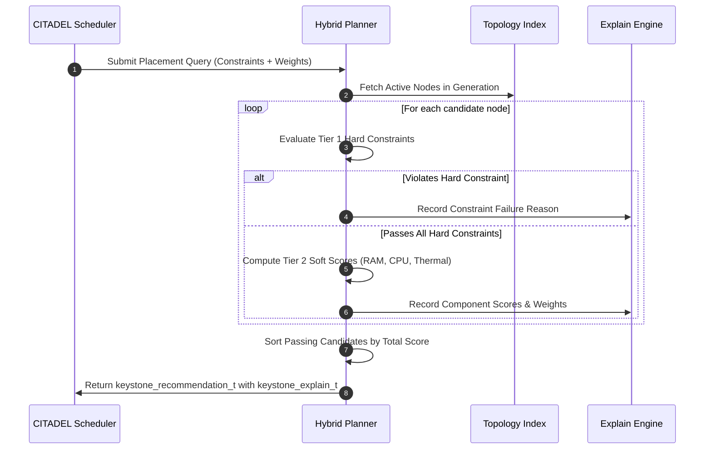

<!--
  SPDX-License-Identifier: AGPL-3.0-or-later
  Copyright (C) 2026 SWORDIntel. All rights reserved.
-->

# Two-Tier Hybrid Query Planner Architecture

This document specifies the two-tier planning architecture, hard-constraint boolean pruning, soft-objective multi-criteria ranking, and query lifecycle implemented in the KEYSTONE Hybrid Planner subsystem.

Governed by Phase 3 of [`CITADEL/docs/architecture/KEYSTONE_FEDERATION_INTELLIGENCE_UPGRADE_BRIEF.md`](../../../CITADEL/docs/architecture/KEYSTONE_FEDERATION_INTELLIGENCE_UPGRADE_BRIEF.md), the hybrid planner evaluates candidate infrastructure placements and routing paths, separating non-negotiable correctness constraints from optimizable performance heuristics.

---

## 1. Two-Tier Planning Philosophy

Infrastructure placement in hypervisors and distributed systems often conflates security/correctness rules with performance heuristics, leading to fragile schedulers.

KEYSTONE resolves this with a **strict two-tier query pipeline**:

```text
                  All Candidate Physical Hosts in Cluster
                                    │
                                    ▼
       ┌────────────────────────────────────────────────────────┐
       │ Tier 1: Hard Constraint Evaluation (Boolean Pruning)   │
       │  - Caller Security Clearance & Compartment Bitmasks    │
       │  - Required CPU ISA Features (AVX2, AVX-512, AMX)      │
       │  - Minimum Free RAM & Minimum CPU Cores                │
       │  - Anti-Affinity Rules (Forbidden Failure Domains)     │
       └────────────────────────────────────────────────────────┘
                                    │
                       Passed Hard Constraints Only
                                    │
                                    ▼
       ┌────────────────────────────────────────────────────────┐
       │ Tier 2: Soft Objective Ranking (Multi-Criteria Score)  │
       │  - Normalized Free RAM Margin                          │
       │  - Normalized CPU Headroom (100 - CPU Load %)          │
       │  - Normalized Thermal Headroom (T_crit - T_node)       │
       │  - NUMA Locality & Interconnect Affinity               │
       └────────────────────────────────────────────────────────┘
                                    │
                                    ▼
       Ranked Recommendation Bundle with Complete Explainability
```

- **Tier 1 (Hard Constraints)**: Pure boolean filtering ($0$ or $1$). If a candidate violates *any* hard constraint (e.g. insufficient RAM, lacking AVX-512, or sharing an anti-affinity failure domain), it is pruned immediately. It cannot be compensated for by high soft scores.
- **Tier 2 (Soft Objectives)**: Continuous normalized scoring ($[0.0, 1.0]$). Surviving candidates are ranked using configurable weights, producing a Pareto-optimal ordering.

---

## 2. Hard Constraint Pruning (Tier 1)

Defined in [`include/keystone_hybrid.h`](file:///home/john/Documents/KEYSTONE/include/keystone_hybrid.h):

```c
typedef struct {
    uint32_t min_ram_mb;              /* Minimum free memory required */
    uint16_t min_cpu_cores;           /* Minimum logical CPU cores */
    uint64_t required_cpu_isa_flags;  /* Mask of required CPU features */
    uint32_t forbidden_failure_domain;/* Anti-affinity failure domain */
    uint16_t min_clearance_level;     /* Minimum clearance level */
    uint64_t required_compartments;   /* Required security compartments */
} keystone_hard_constraints_t;
```

### Pruning Logic
For each candidate node $N$:
1. **Security Clearance**:
   $$\text{Check}(N.\text{clearance} \ge C.\text{min\_clearance} \land (C.\text{required\_compartments} \ \& \ \sim N.\text{compartments}) == 0)$$
2. **Silicon ISA Match**:
   $$\text{Check}((N.\text{cpu\_isa\_flags} \ \& \ C.\text{required\_cpu\_isa\_flags}) == C.\text{required\_cpu\_isa\_flags})$$
3. **Capacity Thresholds**:
   $$\text{Check}(N.\text{ram\_free\_mb} \ge C.\text{min\_ram\_mb} \land N.\text{cpu\_cores} \ge C.\text{min\_cpu\_cores})$$
4. **Anti-Affinity / Failure Domain Isolation**:
   $$\text{Check}(C.\text{forbidden\_failure\_domain} == 0 \lor N.\text{failure\_domain\_id} \ne C.\text{forbidden\_failure\_domain})$$

If any check fails, the candidate is discarded, and the exact failure reason is recorded in the explanation bundle.

---

## 3. Soft Objective Ranking (Tier 2)

Surviving candidates are scored against normalized objective functions:

```c
typedef struct {
    float weight_ram_headroom;  /* Default: 0.35 */
    float weight_cpu_headroom;  /* Default: 0.25 */
    float weight_thermal;       /* Default: 0.25 */
    float weight_numa_locality; /* Default: 0.15 */
} keystone_soft_weights_t;
```

### Scoring Equations

1. **Free RAM Headroom**:
   $$S_{RAM} = \min\left(1.0, \frac{N.\text{ram\_free\_mb}}{N.\text{ram\_total\_mb}}\right)$$

2. **CPU Headroom**:
   $$S_{CPU} = \frac{100 - N.\text{cpu\_load\_pct}}{100.0}$$

3. **Thermal Margin**:
   $$S_{Thermal} = \max\left(0.0, \min\left(1.0, \frac{85 - N.\text{temperature\_c}}{85 - 20}\right)\right)$$

4. **Total Composite Score**:
   $$S_{Total} = w_{RAM} \cdot S_{RAM} + w_{CPU} \cdot S_{CPU} + w_{Thermal} \cdot S_{Thermal} + w_{NUMA} \cdot S_{NUMA}$$

Candidates are sorted in descending order of $S_{Total}$.

---

## 4. Query Execution Lifecycle



---

## 5. Explainable Provenance

The planner outputs a [`keystone_recommendation_t`](file:///home/john/Documents/KEYSTONE/include/keystone_federation.h) coupled with a [`keystone_explain_t`](file:///home/john/Documents/KEYSTONE/include/keystone_federation.h) for every recommended node:

- **Constraint Auditing**: Explicitly states which hard rules passed and which were checked.
- **Score Deconstruction**: Breaks down composite scores into individual contributions ($S_{RAM}$, $S_{CPU}$, $S_{Thermal}$).
- **State Lineage**: Links the decision to the active index generation, cluster fencing epoch, and causal HLC timestamp.
- **Strict Non-Authority**: The bundle serves as an advisory evidence package for CITADEL hypervisor controllers, never initiating physical VM migration or hypercall execution directly.
