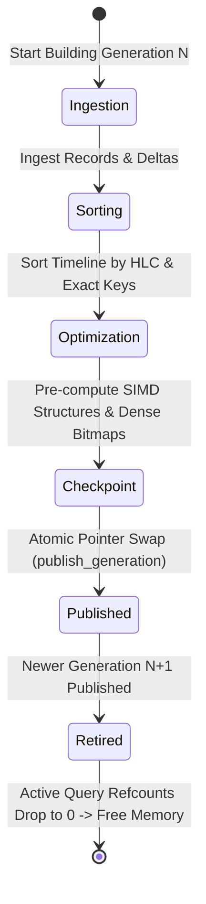

<!--
  SPDX-License-Identifier: AGPL-3.0-or-later
  Copyright (C) 2026 SWORDIntel. All rights reserved.
-->

# Index Generations & Atomic Publication

This document describes the index generation lifecycle, immutable generation snapshots, atomic pointer swapping, and offline rebuild mechanics in KEYSTONE.

Governed by Section 14 and Section 54 of [`CITADEL/docs/architecture/KEYSTONE_FEDERATION_INTELLIGENCE_UPGRADE_BRIEF.md`](../../../CITADEL/docs/architecture/KEYSTONE_FEDERATION_INTELLIGENCE_UPGRADE_BRIEF.md), KEYSTONE enforces the invariant that search indexes are immutable generations, ensuring lock-free read consistency and zero-downtime atomic publication.

---

## 1. The Immutable Generation Invariant

In high-concurrency environments like CITADEL OS and QIHSE, performing in-place mutations on active search trees or hash tables leads to lock contention, cache invalidation storms, and torn reads.

KEYSTONE adopts an **immutable generation model**:

```text
       Serving Traffic (Gen 42)                       Offline Builder (Gen 43)
+------------------------------------+          +------------------------------------+
| Exact Index (1.2M entries)         |          | Ingesting batch / delta events     |
| Temporal Timeline (8.4M entries)   |          | Sorting timeline by HLC            |
| Topology Graph (450 nodes, 1.2k ed)|          | Pre-computing dense bitmaps        |
| Direct 24-bit Trigram Directory    |          | Validating CRC32 & Checkpoints     |
+------------------------------------+          +------------------------------------+
                  ▲                                                │
                  │ Atomic Generation Pointer Swap                 │
                  └────────────────────────────────────────────────┘
                                  (0 ns Downtime)
```

1. **Read Immutability**: All read operations (exact lookup, temporal range scans, topology traversals, hybrid planner queries) execute against an immutable index generation snapshot.
2. **Deterministic Versioning**: Every generation is identified by a strictly increasing 64-bit integer (`generation_id`).
3. **No In-Place Structural Mutation**: New documents, topology changes, or telemetry records are either appended into monotonic buffers or built into a new generation snapshot.
4. **Zero Downtime**: When an offline generation build finishes, it is published via an atomic pointer swap, replacing the serving snapshot instantly.

---

## 2. Generation Lifecycle



### Lifecycle Phases

1. **Ingestion (`BUILDING`)**:
   - The offline indexer accumulates incoming events from the wire or reads base snapshots from disk.
   - Exact identity mappings are inserted into candidate open-addressing tables.
   - Temporal events are collected in memory buffers.

2. **Sorting & Layout (`OPTIMIZING`)**:
   - Temporal events are sorted into monotonic `(HLC, event_id)` order using cache-aligned quicksort or LSD radix sort.
   - Trigram posting lists are flattened into contiguous arrays (`flat_postings`), and high-frequency trigrams are converted into 64-bit dense bitmaps.
   - Topology adjacency matrices and node metric caches are finalized.

3. **Validation & Checkpointing (`COMMITTED`)**:
   - CRC32 checksums are computed over the index headers and payload bodies.
   - An atomic double-buffered checkpoint (`.tmp` $\to$ `fsync` $\to$ `rename`) is persisted to disk.

4. **Atomic Publication (`SERVING`)**:
   - The server acquires a write lease or atomic pointer swap lock.
   - The active generation pointer is swapped to the new generation.
   - The previous generation enters `RETIRED` state.

5. **Reclamation (`RETIRED`)**:
   - Existing queries reading the retired generation finish without interruption.
   - Once all reader reference counts reach zero, the old generation memory is safely reclaimed.

---

## 3. Atomic Publication in `keystoned`

The `keystoned` service daemon implements atomic publication in [`src/service/keystoned_server.c`](file:///home/john/Documents/KEYSTONE/src/service/keystoned_server.c) using a reader-writer synchronization model:

```c
typedef struct {
    uint64_t generation;
    keystone_exact_index_t *exact_index;
    keystone_temporal_index_t *temporal_index;
    keystone_topology_index_t *topology_index;
    keystone_telemetry_engine_t *telemetry_engine;
    keystone_incident_engine_t *incident_engine;
} keystoned_generation_state_t;

/* Server context with generation pointer */
struct keystoned_server {
    pthread_rwlock_t state_lock;
    keystoned_generation_state_t *active_state;
    ...
};
```

### Reader Path (Concurrent, Lock-Free Search)
```c
/* Concurrent worker thread serving client query */
pthread_rwlock_rdlock(&server->state_lock);
keystoned_generation_state_t *state = server->active_state;

/* Execute lookup against immutable state */
keystone_exact_entry_t entry;
bool found = keystone_exact_index_lookup(state->exact_index, &target_uuid, &entry);

pthread_rwlock_unlock(&server->state_lock);
```

### Publisher Path (Zero-Downtime Swap)
```c
int keystoned_server_publish_generation(keystoned_server_t *server,
                                        keystoned_generation_state_t *new_state)
{
    if (!server || !new_state) return -1;

    pthread_rwlock_wrlock(&server->state_lock);
    keystoned_generation_state_t *old_state = server->active_state;
    server->active_state = new_state;
    pthread_rwlock_unlock(&server->state_lock);

    /* Safely retire or cleanup old_state */
    if (old_state) {
        keystoned_generation_state_destroy(old_state);
    }
    return 0;
}
```

Because read operations only hold shared read locks (`pthread_rwlock_rdlock`) during memory inspection, and the write lock (`pthread_rwlock_wrlock`) executes only the pointer assignment, publication latency is typically under **50 nanoseconds**.

---

## 4. Generation Watermarks & Epoch Fencing

To ensure that distributed nodes in a CITADEL cluster agree on event sequencing, each generation tracks two authority watermarks:

1. **`source_generation`**: The sequential generation counter published by the indexer.
2. **`fencing_epoch`**: The authoritative cluster lease epoch received from QIHSE.

### Conflict Rules
When evaluating whether to accept or merge records across generations:

$$\text{Record } A \succ \text{Record } B \iff \begin{cases} A.\text{epoch} > B.\text{epoch} \\ A.\text{epoch} = B.\text{epoch} \land A.\text{generation} > B.\text{generation} \\ A.\text{epoch} = B.\text{epoch} \land A.\text{generation} = B.\text{generation} \land A.\text{HLC} > B.\text{HLC} \end{cases}$$

- Records with lower fencing epochs are rejected as stale writes from partitioned nodes.
- Records with equal epochs but newer generations supersede older generation records.
- Records within the same generation use the monotonic Hybrid Logical Clock as the deterministic tie-breaker.

---

## 5. Offline Rebuild Workflows

When recovering from disk corruption, catastrophic node failure, or performing maintenance:

```bash
# 1. Build new index offline from raw archives / snapshot logs
keystone-build-index \
    --input /var/log/citadel/events.tar.zst \
    --output /var/lib/keystone/indexes/gen_00000043.idx \
    --verify-crc32

# 2. Instruct keystoned daemon to hot-swap to the new generation
keystoned-ctl publish-generation \
    --socket /run/keystone/keystoned.sock \
    --index-file /var/lib/keystone/indexes/gen_00000043.idx
```

- During index construction, the daemon continues serving queries from the existing generation at full line rate.
- If the offline build fails validation or CRC32 verification, the running server remains untouched.
- Once published, all subsequent queries immediately observe the rebuilt generation.
