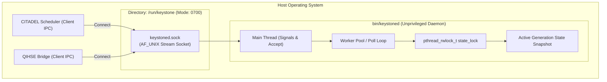

<!--
  SPDX-License-Identifier: AGPL-3.0-or-later
  Copyright (C) 2026 SWORDIntel. All rights reserved.
-->

# `keystoned` Native Service Daemon Architecture

This document specifies the service architecture, binary IPC protocol, socket security, worker concurrency, and generation publication of the `keystoned` native service daemon.

Governed by Phase 2 of [`CITADEL/docs/architecture/KEYSTONE_FEDERATION_INTELLIGENCE_UPGRADE_BRIEF.md`](../../../CITADEL/docs/architecture/KEYSTONE_FEDERATION_INTELLIGENCE_UPGRADE_BRIEF.md), `keystoned` runs as an unprivileged background daemon providing low-latency search and recommendation services over local Unix domain sockets.

---

## 1. Daemon Architecture & Socket Security

`keystoned` isolates indexing and search compute from hypervisor processes while maintaining near-native IPC speeds:



### Security & Privilege Isolation
- **Socket Path**: Defaults to `/run/keystone/keystoned.sock` (configurable via `-s <path>`).
- **Directory Permissions**: Enforces `0700` (`rwx------`) on the parent socket directory.
- **Unprivileged Execution**: Drops capabilities and runs under dedicated user `keystone`.
- **Peer Credentials**: Verifies client UID and GID via Linux `SO_PEERCRED`.

---

## 2. Compact Binary IPC Protocol

Client-daemon communication uses a compact binary framing format with IEEE 802.3 CRC32 checksums, defined in [`include/keystoned.h`](file:///home/john/Documents/KEYSTONE/include/keystoned.h):

### Request Header (36 bytes)
```c
typedef struct {
    uint32_t magic;                    /* Constant: 0x4B53444D ('KSDM') */
    uint16_t msg_type;                 /* Request type enum */
    uint16_t flags;                    /* Request flags */
    uint32_t payload_len;              /* Bounded length (<64 MiB) */
    uint32_t crc32;                    /* CRC32 of payload */
    keystone_security_context_t sec;   /* 20 bytes: clearance, compartments, tenant */
} keystoned_req_header_t;
```

### Response Header (16 bytes)
```c
typedef struct {
    uint32_t magic;                    /* Constant: 0x4B53444D ('KSDM') */
    uint16_t msg_type;                 /* Echo of request type */
    uint16_t status;                   /* Status code (OK, DENIED, NOT_FOUND) */
    uint32_t payload_len;              /* Response payload size */
    uint32_t crc32;                    /* CRC32 of response payload */
} keystoned_resp_header_t;
```

### Protocol Message Types

| Message Type | Hex Code | Operation |
|---|---|---|
| `KEYSTONED_MSG_EXACT_LOOKUP` | `0x0001` | Query exact identity by 128-bit UUID. |
| `KEYSTONED_MSG_TEMPORAL_RANGE` | `0x0002` | Query monotonic timeline slice by HLC range. |
| `KEYSTONED_MSG_TOPOLOGY_NEIGHBORS` | `0x0003` | Query graph neighbors by edge mask. |
| `KEYSTONED_MSG_HYBRID_RECOMMEND` | `0x0004` | Execute two-tier placement/routing query. |
| `KEYSTONED_MSG_INCIDENT_SIMILAR` | `0x0005` | Search top-K similar historical failures. |
| `KEYSTONED_MSG_RAG_CONTEXT` | `0x0006` | Extract citation-backed evidence context pack. |
| `KEYSTONED_MSG_PUBLISH_GENERATION` | `0x0007` | Admin: Hot-swap to newly built generation. |

---

## 3. Server Poll Concurrency & Atomic Publication

Implemented in [`src/service/keystoned_server.c`](file:///home/john/Documents/KEYSTONE/src/service/keystoned_server.c):

1. **Non-Blocking I/O & `poll()`**: The server accepts incoming connections and monitors worker file descriptors without spawning unbounded threads.
2. **Reader-Writer Generation Lock**:
   - Queries acquire a shared read lock (`pthread_rwlock_rdlock`) on `server->state_lock`.
   - Thousands of concurrent client lookups execute in parallel against the active generation.
3. **Atomic Generation Publication**:
   - When an offline build finishes, an administrative IPC or CLI command invokes `keystoned_server_publish_generation()`.
   - Acquires an exclusive write lock (`pthread_rwlock_wrlock`), updates the generation pointer, and releases the lock.
   - Reader threads switch to the new generation with **zero connection resets and zero query drops**.

---

## 4. Client Library Integration (`keystoned_client`)

Applications link against [`include/keystoned.h`](file:///home/john/Documents/KEYSTONE/include/keystoned.h) and [`src/service/keystoned_client.c`](file:///home/john/Documents/KEYSTONE/src/service/keystoned_client.c):

```c
/* Initialize client connection */
keystoned_client_t *client = keystoned_client_create("/run/keystone/keystoned.sock");
if (keystoned_client_connect(client) != 0) {
    /* Handle fallback */
}

/* Configure caller security context */
keystone_security_context_t sec = {
    .tenant_id = 1001,
    .clearance_level = KEYSTONE_CLEARANCE_SECRET,
    .compartment_mask = 0x0000000000000001ULL,
    .node_id = 42,
    .audit_id = 9999
};

/* Execute exact identity lookup */
keystone_exact_entry_t entry;
int status = keystoned_client_lookup_exact(client, &sec, &target_uuid, &entry);
if (status == KEYSTONED_STATUS_OK) {
    printf("Found entity: latest generation = %lu\n", entry.latest_generation);
} else if (status == KEYSTONED_STATUS_DENIED) {
    /* Caller lacked security clearance: zero metadata leaked */
}
```

---

## 5. CLI Usage & Operations

The daemon executable is built at `bin/keystoned`:

```bash
# Start daemon with default socket path (/run/keystone/keystoned.sock)
bin/keystoned

# Start with custom socket and daemonize
bin/keystoned -s /tmp/keystoned_test.sock -d

# Print version and capabilities
bin/keystoned -v
```

### Signal Handling
- `SIGINT` / `SIGTERM`: Initiates graceful shutdown, closes socket, flushes checkpoints, and reclaims memory.
- `SIGHUP`: Triggers generation reload or configuration refresh.
