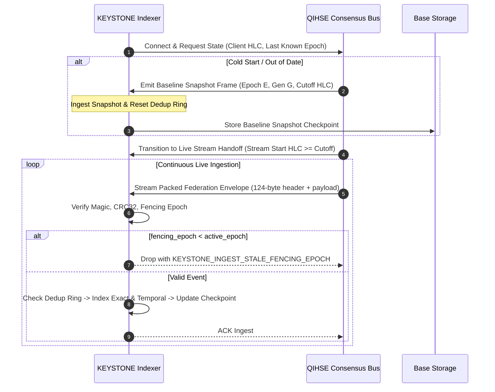

<!--
  SPDX-License-Identifier: AGPL-3.0-or-later
  Copyright (C) 2026 SWORDIntel. All rights reserved.
-->

# QIHSE / KEYSTONE Ingestion Stream Contract

This document defines the interface contract, boundary rules, stream handshake, snapshot bootstrapping, and fencing protocols between QIHSE and KEYSTONE.

Governed by Section 52, 53, and 55 of [`CITADEL/docs/architecture/KEYSTONE_FEDERATION_INTELLIGENCE_UPGRADE_BRIEF.md`](../../../CITADEL/docs/architecture/KEYSTONE_FEDERATION_INTELLIGENCE_UPGRADE_BRIEF.md), this contract establishes formal boundaries between cluster truth and retrieval acceleration.

---

## 1. System Roles & Division of Responsibilities

```text
+------------------------------------------------------------------------------------+
| QIHSE: The System of Record & Consensus Engine                                     |
|  - Holds Raft consensus state machine.                                             |
|  - Owns lease distribution and fencing epoch increments.                           |
|  - Issues cryptographic tokens and audit sequence IDs.                             |
|  - Guarantees durability and linearization of state mutations.                     |
+------------------------------------------------------------------------------------+
                                      │
                                      │ Ingestion Stream (Snapshot + Delta Stream)
                                      ▼
+------------------------------------------------------------------------------------+
| KEYSTONE: The Evidence, Indexing & Acceleration Engine                             |
|  - Sub-millisecond exact identity and monotonic temporal lookup.                   |
|  - Streaming telemetry aggregation and statistical anomaly detection.             |
|  - Incident vector similarity search across hardware accelerators (AMX/AVX/CUDA).  |
|  - Non-authoritative, explainable recommendation bundles.                          |
+------------------------------------------------------------------------------------+
```

### Invariant Rules
1. **KEYSTONE is Never Authoritative**: If KEYSTONE and QIHSE disagree, QIHSE's state is absolute truth. KEYSTONE indexes must adjust or rebuild from QIHSE snapshots.
2. **Crash Resilience**: If KEYSTONE becomes unavailable, QIHSE and CITADEL continue cluster operations without stalling. Retrieval latency degrades, but correctness and consensus remain uncompromised.
3. **No Direct State Mutation**: KEYSTONE never commits writes directly to QIHSE Raft logs without passing through authenticated client APIs.

---

## 2. Ingest Lifecycle: Snapshot Bootstrap + Live Stream Handoff

When a KEYSTONE indexer boots or reconnects after a network partition:



### 1. Snapshot Bootstrap Phase
- QIHSE transmits a complete point-in-time snapshot of active resources.
- Records bear `KEYSTONE_FLAG_SNAPSHOT`.
- KEYSTONE initializes its exact identity table, clearing previous tombstones.

### 2. Live Stream Transition
- QIHSE hands off the stream at or slightly before the snapshot cutoff HLC.
- KEYSTONE uses its 9.3M ops/sec deduplication ring to seamlessly ignore duplicate events already incorporated into the snapshot.

---

## 3. Fencing Epochs & Split-Brain Invariants

In distributed failovers, an old primary node may attempt to emit stale updates after losing its lease:

```c
/* Ingestion Fencing Enforcement */
if (envelope->fencing_epoch < engine->active_fencing_epoch) {
    /* Reject immediately: emitted by a partitioned or fenced leader */
    return KEYSTONE_INGEST_STALE_FENCING_EPOCH;
}

if (envelope->fencing_epoch > engine->active_fencing_epoch) {
    /* Authoritative epoch advancement from QIHSE consensus */
    engine->active_fencing_epoch = envelope->fencing_epoch;
    log_epoch_transition(envelope->fencing_epoch);
}
```

This prevents split-brain writes from polluting search indexes or confusing recommendation planners.

---

## 4. Tombstone Semantics & Resurrection

When an entity (e.g. VM `d3c1...`) is deleted in QIHSE:
1. QIHSE emits a wire envelope with `KEYSTONE_FLAG_TOMBSTONE` set.
2. KEYSTONE records `source_object_id` in the tombstone registry.
3. Subsequent exact lookups return false/empty with zero metadata leakage.
4. If an entity with the same UUID is recreated with a newer `generation` and `hlc`, the tombstone is cleared, permitting resurrection while maintaining strict causal ordering.

---

## 5. Checkpoint Watermarking

KEYSTONE periodically persists double-buffered state checkpoints (`.tmp` $\to$ `fsync` $\to$ `rename`):
- Persists `last_applied_hlc`, `fencing_epoch`, and `generation_id`.
- On restart, KEYSTONE presents this watermark to QIHSE, requesting only delta events that occurred after `last_applied_hlc`, avoiding unnecessary full snapshot transfers.
