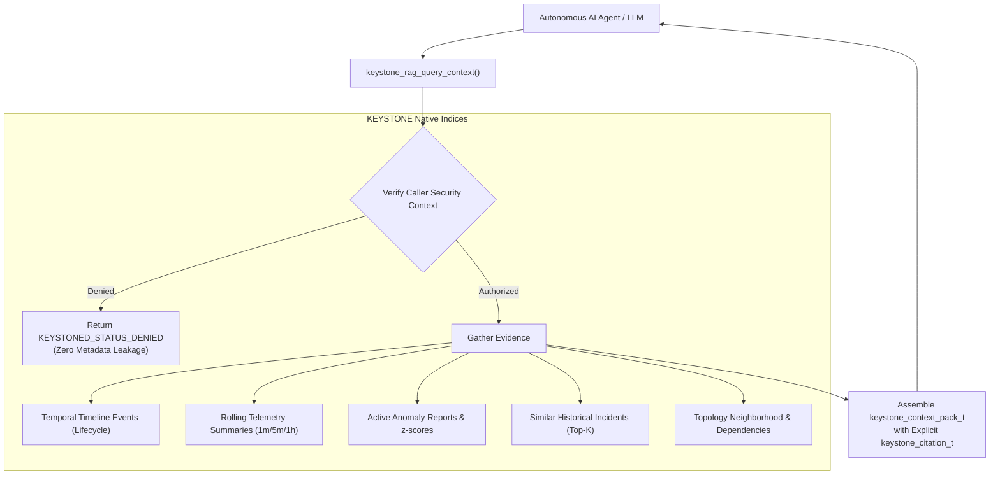

<!--
  SPDX-License-Identifier: AGPL-3.0-or-later
  Copyright (C) 2026 SWORDIntel. All rights reserved.
-->

# AI/RAG Context Retrieval & Cryptographic Model Governance

This document specifies the structured evidence retrieval pipeline (RAG Context Packs), traceable citations, and cryptographic model governance engine implemented in KEYSTONE.

Governed by Phase 7 of [`CITADEL/docs/architecture/KEYSTONE_FEDERATION_INTELLIGENCE_UPGRADE_BRIEF.md`](../../../CITADEL/docs/architecture/KEYSTONE_FEDERATION_INTELLIGENCE_UPGRADE_BRIEF.md), this subsystem provides deterministic, citation-backed grounding data for LLM/AI agents while preventing untrusted models from executing over CITADEL infrastructure.

---

## 1. Grounded Infrastructure RAG Overview

LLMs and autonomous triage agents in CITADEL must not hallucinate system state or act on unverified assumptions.

KEYSTONE provides a **constrained Retrieval-Augmented Generation (RAG) endpoint** that extracts comprehensive, citation-backed context packs directly from native index structures:



---

## 2. Structured Evidence Context Pack (`keystone_context_pack_t`)

Defined in [`include/keystone_rag.h`](file:///home/john/Documents/KEYSTONE/include/keystone_rag.h):

```c
typedef struct {
    keystone_uuid_t target_resource_id;     /* Target resource under investigation */
    uint32_t tenant_id;                     /* Verified tenant boundary */
    uint64_t retrieval_generation;          /* Generation of active index */
    keystone_hlc_t retrieval_hlc;           /* Causal timestamp of retrieval */

    /* Monotonic Timeline Evidence */
    keystone_temporal_entry_t *recent_events;
    uint32_t event_count;

    /* Rolling Telemetry Summaries */
    keystone_feature_window_t *telemetry_features;
    uint32_t feature_count;

    /* Active Anomaly Alerts */
    keystone_explain_t *active_anomalies;
    uint32_t anomaly_count;

    /* Top-K Similar Historical Incidents */
    keystone_incident_record_t *similar_incidents;
    uint32_t incident_count;

    /* Topology Dependencies */
    keystone_uuid_t *topology_neighbors;
    uint32_t neighbor_count;

    /* Explicit Grounding Citations */
    keystone_citation_t *citations;
    uint32_t citation_count;
} keystone_context_pack_t;
```

Every piece of returned data is bounded, strongly typed, and guaranteed to reflect the exact state of the cluster at `retrieval_hlc`.

---

## 3. Explicit Traceable Citations (`keystone_citation_t`)

To ensure non-repudiation and prevent AI hallucinations, every fact included in the context pack carries an explicit citation:

```c
typedef struct {
    uint32_t citation_id;        /* Sequential citation index [1, 2, ...] */
    keystone_uuid_t source_uuid; /* Exact UUID of resource or event */
    uint32_t source_node_id;     /* Physical cluster node of origin */
    uint64_t source_generation;  /* Generation at which data was indexed */
    keystone_hlc_t source_hlc;   /* Monotonic causal timestamp */
    uint32_t fact_type;          /* LIFECYCLE, TELEMETRY, ANOMALY, TOPOLOGY */
    char evidence_ref[128];      /* Machine-parseable locator (e.g. "temp_1m.mean") */
} keystone_citation_t;
```

When an LLM generates a diagnostic report, it references these citation IDs directly:
> *"Node 104 experienced a thermal runaway event at HLC [24089.1] (Citation 1), with mean temperature reaching 88.4°C (Citation 2). This pattern matches Incident [f4a8...] with 96.2% similarity (Citation 3)."*

---

## 4. Cryptographic Model Governance

Autonomous models must not operate inside CITADEL without verified provenance, capability checks, and cryptographic integrity.

KEYSTONE maintains a formal **Model Governance Registry** (`keystone_model_manifest_t`):

```c
typedef enum {
    KEYSTONE_TASK_PLACEMENT  = (1 << 0), /* Workload placement recommendation */
    KEYSTONE_TASK_ANOMALY    = (1 << 1), /* Anomaly detection & classification */
    KEYSTONE_TASK_SIMILARITY = (1 << 2), /* Incident vector similarity search */
    KEYSTONE_TASK_RAG        = (1 << 3)  /* Structured context extraction */
} keystone_model_task_t;

typedef struct {
    char model_name[64];             /* Model identifier (e.g. "keystone-embed-v2") */
    uint32_t model_version;          /* Semantic version integer */
    uint32_t supported_tasks;        /* Bitmask of authorized task capabilities */
    uint8_t  sha256_weight_hash[32]; /* Cryptographic SHA-256 hash of model weights */
    uint32_t min_clearance_required; /* Minimum clearance needed to invoke */
    bool     is_active;              /* Administrative revocation toggle */
} keystone_model_manifest_t;
```

### Model Governance Verification Rules

Before allowing any model to process data or emit recommendations:
1. **Manifest Registration**: The model must be registered in the engine manifest table.
2. **Capability Check**: The requested task must match the model's `supported_tasks` bitmask (`keystone_model_validate_task`).
3. **Cryptographic SHA-256 Validation**: On startup or model load, `keystone_model_verify_integrity()` computes the SHA-256 hash of the resident weight buffers and compares it against `sha256_weight_hash`:
   - If the hashes do not match (indicating corruption, bit rot, or unauthorized tampering), the model is quarantined immediately, and the engine refuses to run inference.
4. **Security Level Match**: Callers must possess clearance $\ge \text{min\_clearance\_required}$.

This ensures complete cryptographic provenance across all AI and recommendation pathways in CITADEL.
