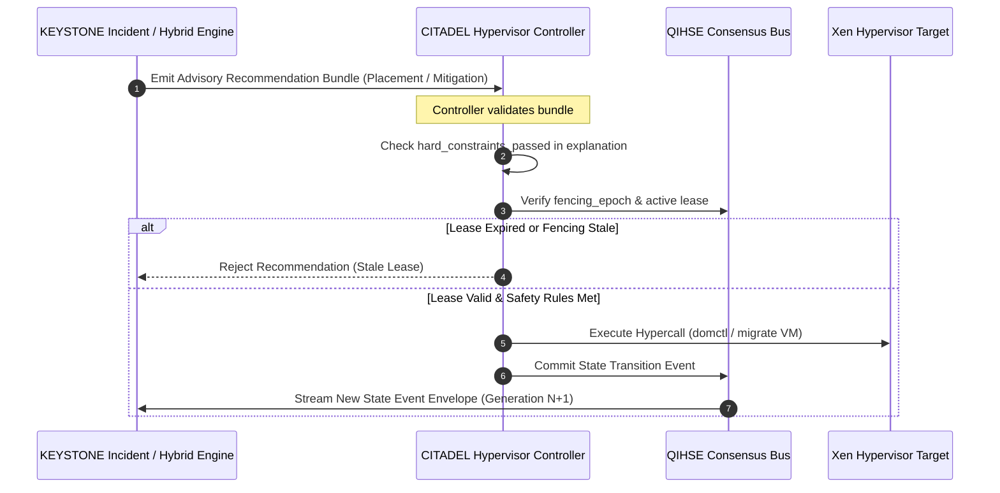

<!--
  SPDX-License-Identifier: AGPL-3.0-or-later
  Copyright (C) 2026 SWORDIntel. All rights reserved.
-->

# Explainable Recommendation Engine Architecture

This document defines the recommendation structures, explainability evidence bundles, score deconstruction, and non-authoritative invariants governing the KEYSTONE Recommendation Engine.

Governed by Section 52 and Section 55 of [`CITADEL/docs/architecture/KEYSTONE_FEDERATION_INTELLIGENCE_UPGRADE_BRIEF.md`](../../../CITADEL/docs/architecture/KEYSTONE_FEDERATION_INTELLIGENCE_UPGRADE_BRIEF.md), KEYSTONE acts as an advisory intelligence and evidence accelerator for CITADEL OS and QIHSE.

---

## 1. The Cardinal Architectural Principle

> **"KEYSTONE may recommend, rank, correlate, predict, and accelerate. It must not silently become authoritative."**

```text
+-------------------------------------------------------------------------------+
|                             CITADEL ECOSYSTEM                                 |
+-------------------------------------------------------------------------------+
|  QIHSE                ==>  Consensus, Truth, Leases, Fencing Epochs           |
|  KEYSTONE             ==>  Evidence, Telemetry, Similarity, Recommendations   |
|  CITADEL Controller   ==>  Policy Validation, Hypervisor Control, Execution   |
+-------------------------------------------------------------------------------+
```

1. **No Silent State Changes**: KEYSTONE never migrates a VM, changes network routing, or fences a node directly.
2. **Advisory Bundles**: All suggestions are emitted as structured recommendation bundles containing complete provenance and hard-constraint validation.
3. **Controller Independence**: The CITADEL hypervisor controller evaluates KEYSTONE's evidence against its own safety rules and leases before taking action. If KEYSTONE crashes or becomes unavailable, the cluster falls back to static placement rules without stalling execution.

---

## 2. Recommendation Data Structures

Defined in [`include/keystone_federation.h`](file:///home/john/Documents/KEYSTONE/include/keystone_federation.h):

```c
typedef struct {
    keystone_uuid_t recommendation_id; /* Unique recommendation UUID */
    keystone_uuid_t target_resource_id; /* VM, Volume, or Node being evaluated */
    uint32_t recommended_node_id;       /* Top-ranked physical host candidate */
    float confidence_score;             /* Composite confidence score [0.0..1.0] */
    uint64_t engine_generation;         /* Index generation used to compute */
    uint64_t fencing_epoch;             /* Consensus epoch verified during run */
    keystone_hlc_t decision_hlc;        /* Causal HLC timestamp */
    uint32_t pass_count;                /* Total candidates passing Tier 1 */
    uint32_t total_evaluated;           /* Total candidates considered */
    uint32_t action_type;               /* PLACEMENT, EVACUATION, SCALE, THROTTLE */
    keystone_explain_t explanation;     /* Detailed evidence breakdown */
} keystone_recommendation_t;
```

---

## 3. Explainability Evidence Bundle (`keystone_explain_t`)

A recommendation is only as good as its transparency. Operators and autonomous controllers must know *why* an action is recommended.

```c
typedef struct {
    char rationale[256];              /* Human-readable summary */
    uint32_t hard_constraints_passed; /* Bitmask of hard rules verified */
    uint32_t hard_constraints_failed; /* Bitmask of hard rules violated */
    float score_ram_headroom;         /* Normalized RAM score */
    float score_cpu_headroom;         /* Normalized CPU score */
    float score_thermal;              /* Normalized thermal score */
    float score_numa_locality;        /* Normalized NUMA score */
    float score_incident_similarity;  /* Similarity score from historical cases */
    uint32_t severity_level;          /* INFO, WARNING, CRITICAL, EMERGENCY */
    keystone_uuid_t matched_incident_id; /* Similar past incident UUID */
    uint32_t caller_audit_id;         /* Caller's tracking token */
} keystone_explain_t;
```

### Explanation Capabilities:
- **Hard-Constraint Audit**: Lists exact reasons why other candidates were rejected (e.g. `FAILED_INSUFFICIENT_RAM`, `FAILED_ANTI_AFFINITY`).
- **Scoring Provenance**: Shows the exact numeric breakdown across CPU, RAM, thermal, and locality dimensions.
- **Incident Corroboration**: If recommending a mitigation (e.g., throttled I/O), references the UUID of the historical incident that exhibited identical telemetry patterns.

---

## 4. Recommendation Lifecycle in CITADEL



---

## 5. Advisory Domains & Action Types

| Action Type | Value | Trigger | Recommended Outcome |
|---|---|---|---|
| `KEYSTONE_ACTION_PLACEMENT` | `1` | Workload creation or rebalance | Assign VM to optimal host passing all hard constraints. |
| `KEYSTONE_ACTION_EVACUATION` | `2` | Thermal anomaly ($T > 85^\circ\text{C}$) or high $z$-score | Gracefully migrate workloads off degrading host before failure. |
| `KEYSTONE_ACTION_THROTTLE` | `3` | I/O burst anomaly or storage latency spike | Apply cgroup bandwidth limits to rogue tenant. |
| `KEYSTONE_ACTION_MITIGATION` | `4` | High cosine similarity to known incident | Apply known remediations (e.g., flush cache, reload driver). |

By maintaining complete explainability and strict non-authority, KEYSTONE provides autonomous intelligence while preserving CITADEL's fault tolerance and formal security guarantees.
