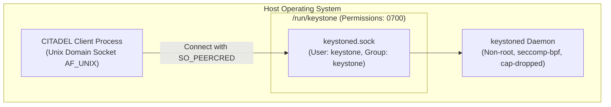

<!--
  SPDX-License-Identifier: AGPL-3.0-or-later
  Copyright (C) 2026 SWORDIntel. All rights reserved.
-->

# Security Context Partitioning & Zero-Leakage Architecture

This document details the security model, classification levels, compartment bitmasks, unprivileged daemon architecture, and zero-metadata-leakage guarantees implemented in KEYSTONE.

Governed by Section 4 and Section 53 of [`CITADEL/docs/architecture/KEYSTONE_FEDERATION_INTELLIGENCE_UPGRADE_BRIEF.md`](../../../CITADEL/docs/architecture/KEYSTONE_FEDERATION_INTELLIGENCE_UPGRADE_BRIEF.md), KEYSTONE enforces mandatory access control (MAC) at every indexing and retrieval layer, preventing unauthorized visibility across tenants, compartments, or classification boundaries.

---

## 1. Threat Model & Design Principles

KEYSTONE operates in multi-tenant, classified CITADEL infrastructure. The threat model accounts for:
- **Tenant Isolation**: Workloads belonging to Tenant $A$ must never observe or infer identifiers belonging to Tenant $B$.
- **Compartment Partitioning**: Even within the same classification level, workloads lacking specific compartment tokens must not see compartment-restricted infrastructure.
- **Side-Channel & Metadata Leakage**: Queries must not reveal the *existence*, *frequency*, or *count* of higher-classification records via error messages, partial counts, or timing deltas.
- **Principle of Least Privilege**: The `keystoned` daemon executes as an unprivileged service user without access to hypervisor control planes.

---

## 2. Security Context Definition

The core security descriptor is [`keystone_security_context_t`](file:///home/john/Documents/KEYSTONE/include/keystoned.h):

```c
typedef struct {
    uint32_t tenant_id;        /* Strict isolation domain (e.g. 1001) */
    uint16_t clearance_level;  /* Hierarchical clearance level (0..3) */
    uint16_t reserved;
    uint64_t compartment_mask; /* Bitmask of authorized compartments */
    uint32_t node_id;          /* Node originating the request */
    uint32_t audit_id;         /* Traceable request identifier */
} keystone_security_context_t;
```

### Hierarchical Clearance Levels

| Level Value | Constant Name | Description |
|---|---|---|
| `0` | `KEYSTONE_CLEARANCE_UNCLASSIFIED` | Standard unclassified system data. |
| `1` | `KEYSTONE_CLEARANCE_CONFIDENTIAL` | Operational infrastructure telemetry. |
| `2` | `KEYSTONE_CLEARANCE_SECRET` | Restricted VM metadata and network routes. |
| `3` | `KEYSTONE_CLEARANCE_TOP_SECRET` | Fenced cryptographic assets and security domains. |

### Compartment Bitmask
A 64-bit mask (`compartment_mask`) representing disjoint operational compartments (e.g., `FINANCIAL`, `HEALTHCARE`, `INTELLIGENCE_ANALYTICS`, `DEFENSE`).
- Each bit corresponds to a specific authorized compartment.
- A caller can access a compartmented resource if and only if the caller's bitmask contains **all** compartment bits required by the resource:
  $$(\text{resource}.\text{compartments} \ \& \ \sim\text{caller}.\text{compartments}) = 0$$

---

## 3. Mandatory Access Control Verification

The fundamental access check is defined in [`keystone_security_check()`](file:///home/john/Documents/KEYSTONE/include/keystoned.h):

```c
static inline bool keystone_security_check(
    const keystone_security_context_t *ctx,
    uint32_t record_tenant,
    uint16_t record_classification,
    uint64_t record_compartments)
{
    if (!ctx) return false;

    /* 1. Strict Tenant Isolation (0 is global administrative tenant) */
    if (ctx->tenant_id != 0 && ctx->tenant_id != record_tenant) {
        return false;
    }

    /* 2. Hierarchical Clearance Check */
    if (ctx->clearance_level < record_classification) {
        return false;
    }

    /* 3. Non-Hierarchical Compartment Check (All required bits must be present) */
    if ((record_compartments & ~ctx->compartment_mask) != 0) {
        return false;
    }

    return true;
}
```

---

## 4. Zero-Metadata-Leakage Invariants

To eliminate timing, enumeration, and existence leakage:

```text
Query for Object UUID: [ 8f2c... ] (Classification: SECRET)
  ├─ Caller Clearance: TOP_SECRET (Pass) ───► Returns Record & Timestamps
  └─ Caller Clearance: UNCLASSIFIED (Fail) ─► Returns KEYSTONED_STATUS_DENIED (Empty Payload)

Range Query for Timeline Events:
  ├─ Raw DB has 10 events: 6 UNCLASSIFIED, 4 SECRET
  ├─ Caller Clearance: UNCLASSIFIED
  └─ Filtered Output: EXACTLY 6 events returned, total_matches = 6
     (The 4 SECRET events are dropped silently; caller never sees total_matches = 10)
```

1. **Existence Invisibility**: If a caller queries an exact record for which they lack clearance, `keystoned` does not return `KEYSTONED_STATUS_UNAUTHORIZED_RESOURCE_FOUND`. It returns `KEYSTONED_STATUS_DENIED` with zero bytes of metadata.
2. **Timeline Aggregation Omission**: In temporal range queries (`keystoned_client_query_temporal`), records failing the caller's security check are filtered out before calculating result counts or allocating response buffers. The caller cannot deduce the existence or rate of classified events from count headers.
3. **Constant-Time Verification**: Security bitmask checks execute branchlessly on CPU registers, eliminating data-dependent timing variance.

---

## 5. Unprivileged Daemon Mode (`keystoned`)

The `keystoned` service daemon runs in an isolated, unprivileged security domain:



### IPC Security Guarantees
- **Unix Domain Socket (`AF_UNIX`)**: Binds exclusively to `/run/keystone/keystoned.sock`.
- **Directory Permissions**: `/run/keystone` is created with mode `0700` (`rwx------`), preventing unauthorized local users from connecting or probing socket state.
- **Caller Identity Verification**: The server extracts client UID/GID using `SO_PEERCRED` on Linux, validating that only authorized system services communicate with the indexer.
- **Input Sanitization**: All inbound messages undergo strict length checks (<64 MiB), header magic verification (`0x4B53444D`), and IEEE 802.3 CRC32 checksum validation prior to parsing.

---

## 6. Audit Provenance & Non-Repudiation

Every query, anomaly alert, and recommendation bundle generated by KEYSTONE retains full audit provenance:

```c
typedef struct {
    keystone_uuid_t recommendation_id;
    uint32_t caller_audit_id;    /* Client-supplied tracking ID */
    uint32_t tenant_id;          /* Verified tenant context */
    uint64_t engine_generation;  /* Generation active when query ran */
    keystone_hlc_t decision_hlc; /* Causal HLC timestamp */
    uint32_t pass_count;         /* Number of passing candidates */
    ...
} keystone_recommendation_t;
```

This ensures that downstream systems consuming KEYSTONE's output can trace every decision back to the exact caller security context, active index generation, and consensus epoch that produced it.
