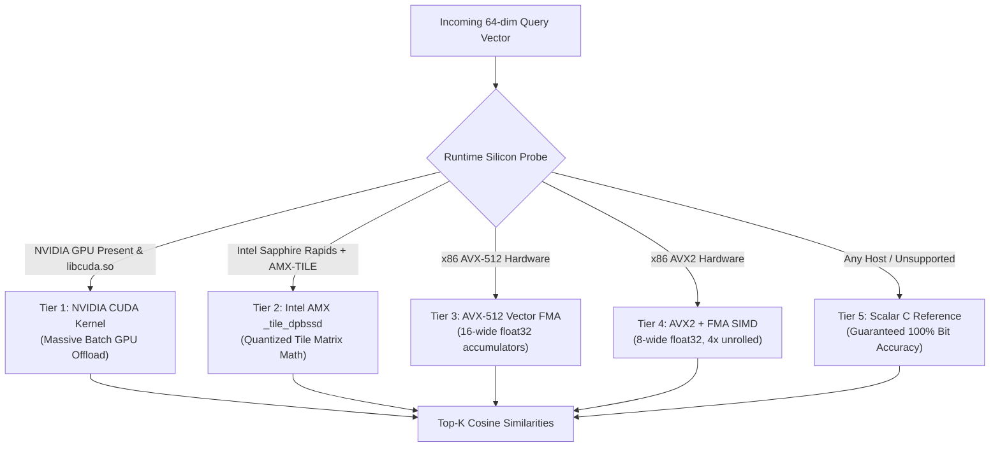

<!--
  SPDX-License-Identifier: AGPL-3.0-or-later
  Copyright (C) 2026 SWORDIntel. All rights reserved.
-->

# Silicon Acceleration & Incident Similarity Engine

This document specifies the 64-dimensional incident vector embeddings, multi-tier hardware silicon dispatch (CUDA, AMX, AVX-512, AVX2, Scalar fallback), and historical incident similarity search in KEYSTONE.

Governed by Phase 5 of [`CITADEL/docs/architecture/KEYSTONE_FEDERATION_INTELLIGENCE_UPGRADE_BRIEF.md`](../../../CITADEL/docs/architecture/KEYSTONE_FEDERATION_INTELLIGENCE_UPGRADE_BRIEF.md), this subsystem enables sub-millisecond pattern matching against historical cluster failures to recommend verified mitigations.

---

## 1. Overview & Failure Pattern Embeddings

When an anomaly occurs in CITADEL, operators want to know:
1. *"Have we seen this failure pattern before?"*
2. *"What mitigation resolved it in the past?"*
3. *"How confident are we in this similarity?"*

KEYSTONE synthesizes complex operational state into a normalized **64-dimensional float32 vector embedding** (`KEYSTONE_INCIDENT_VECTOR_DIM = 64`), defined in [`include/keystone_incident.h`](file:///home/john/Documents/KEYSTONE/include/keystone_incident.h).

```text
Dimension Layout (64 floats, L2-normalized):
  [ 0.. 8]: Normalized Mean Telemetry (CPU, RAM, Disk Read, Disk Write, Net RX, Net TX, Temp, Power, Errors)
  [ 9..17]: Normalized Variance / StdDev for each metric
  [18..26]: Linear Regression Slope Trend (dv/dt) for each metric
  [27..35]: Burst Counts & Spikes
  [36..44]: Error Token Frequencies
  [45..54]: CPU Architecture & Silicon Topology Features (AVX2, AVX-512, AMX, NUMA)
  [55..63]: System Context & Failure Domain Hash Tokens
```

### Synthesis & L2-Normalization
Implemented in `keystone_incident_embed_telemetry()`:
1. Maps rolling feature window values into their designated dimension slots.
2. Applies scale normalization (e.g. CPU $\in [0, 100] \to [0.0, 1.0]$, Temp $\in [20, 100] \to [0.0, 1.0]$).
3. Computes the Euclidean norm:
   $$\|v\|_2 = \sqrt{\sum_{i=0}^{63} v_i^2}$$
4. Divides each element by $\|v\|_2$ to project the vector onto the unit hypersphere ($S^{63}$):
   $$\hat{v} = \frac{v}{\|v\|_2}$$

Because vectors are pre-normalized, the cosine similarity between query vector $Q$ and incident vector $I$ simplifies to a single dot product:
$$\text{sim}(Q, I) = \sum_{i=0}^{63} Q_i \cdot I_i$$

---

## 2. Multi-Tier Silicon Acceleration Dispatch

To search tens of thousands of historical failure cases in sub-millisecond time, KEYSTONE dispatches the distance kernel across five hardware tiers:



### Hardware Acceleration Backends

| Tier | Backend | Hardware Target | Implementation Details |
|---|---|---|---|
| **Tier 1** | **CUDA GPU** | NVIDIA A100/H100/L4 | Dynamically soft-loads `libcuda.so`. Computes batch dot-products across thousands of incident vectors in GPU VRAM. |
| **Tier 2** | **Intel AMX** | Intel Xeon 4th/5th Gen (Sapphire Rapids) | Configures 2D tile registers (`ldtilecfg`). Quantizes 64-dim vectors to int8 and uses `_tile_dpbssd` for 1024-op per cycle matrix math. |
| **Tier 3** | **AVX-512** | Intel Xeon / AMD Zen 4 | 512-bit vector registers (`__m512`), 16 parallel float32 FMA operations per cycle (`_mm512_fmadd_ps`). |
| **Tier 4** | **AVX2 + FMA** | Modern x86_64 CPUs | 256-bit vector registers (`__m256`), 8 parallel float32 operations, 4-way unrolled to saturate execution ports. |
| **Tier 5** | **Scalar C Reference** | Universal CPU fallback | Strict standard C11 scalar loop. Used for verification and systems lacking vector extensions. |

### Correctness & Bit Accuracy Invariant
Every accelerated path is strictly cross-validated against the Scalar C reference path during `make check`. In `tests/test_telemetry_incident_engine.c`, computed similarities across Scalar and AVX2/AVX-512 backends must match within floating-point epsilon ($|S_{accel} - S_{scalar}| < 10^{-5}$).

---

## 3. Incident Store & Top-K Search

Historical incidents are maintained in [`keystone_incident_engine_t`](file:///home/john/Documents/KEYSTONE/include/keystone_incident.h):

```c
typedef struct {
    keystone_uuid_t incident_id;     /* Unique incident identifier */
    uint32_t failure_type;           /* Out of memory, thermal runaway, etc. */
    float embedding[64];             /* 64-dim normalized vector */
    char mitigation_action[256];     /* Advisory mitigation text */
    uint32_t resolved_success_count; /* Times this mitigation succeeded */
    uint64_t incident_hlc;           /* Historical timestamp */
} keystone_incident_record_t;
```

### Search Execution (`keystone_incident_search_similar`)
1. Accepts query vector $Q$ and parameter $K$ (number of nearest neighbors).
2. Computes dot-product similarity against all stored incidents using the highest available silicon tier.
3. Maintains a bounded min-heap of size $K$ to retain the top matches.
4. Returns matching records sorted in descending order of similarity score.

---

## 4. Advisory Mitigations & Provenance

When an incident matches with high similarity ($\text{sim} \ge 0.85$):
- Emits a [`keystone_recommendation_t`](file:///home/john/Documents/KEYSTONE/include/keystone_federation.h) containing `action_type = KEYSTONE_ACTION_MITIGATION`.
- Attaches the historical `matched_incident_id` and the recorded `mitigation_action` string.
- Records the verified resolution success rate (`resolved_success_count`).

This gives CITADEL operators and autonomous controllers actionable, data-backed remediations derived directly from past operational incidents.
