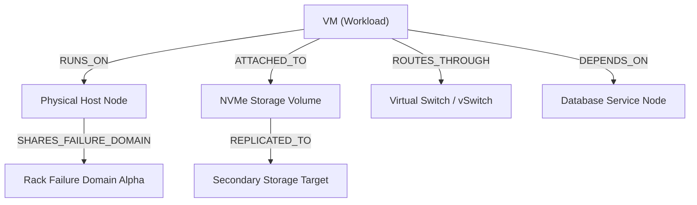

<!--
  SPDX-License-Identifier: AGPL-3.0-or-later
  Copyright (C) 2026 SWORDIntel. All rights reserved.
-->

# Topology Graph Cache Architecture

This document details the in-memory graph cache, relationship primitives, hardware telemetry tracking, and failure domain traversal mechanisms in the KEYSTONE Topology subsystem.

Governed by Phase 3 of [`CITADEL/docs/architecture/KEYSTONE_FEDERATION_INTELLIGENCE_UPGRADE_BRIEF.md`](../../../CITADEL/docs/architecture/KEYSTONE_FEDERATION_INTELLIGENCE_UPGRADE_BRIEF.md), KEYSTONE maintains a fast, read-optimized topology cache to accelerate placement decisions, dependency tracing, and blast radius calculations for CITADEL.

---

## 1. Graph Model & Edge Types

CITADEL infrastructure represents physical hosts, virtual machines, storage volumes, virtual switches, and failure domains as nodes connected by typed directional edges.

Defined in [`include/keystone_topology.h`](file:///home/john/Documents/KEYSTONE/include/keystone_topology.h):

```c
typedef enum {
    KEYSTONE_EDGE_RUNS_ON              = 1, /* Workload execution host (e.g. VM -> Host) */
    KEYSTONE_EDGE_ATTACHED_TO          = 2, /* Attached peripheral (e.g. Storage Volume -> VM) */
    KEYSTONE_EDGE_ROUTES_THROUGH       = 3, /* Network path (e.g. vNIC -> Switch) */
    KEYSTONE_EDGE_DEPENDS_ON           = 4, /* Functional service dependency */
    KEYSTONE_EDGE_REPLICATED_TO        = 5, /* Storage / consensus replication target */
    KEYSTONE_EDGE_SHARES_FAILURE_DOMAIN = 6  /* Common power, rack, or cooling zone */
} keystone_edge_type_t;
```



---

## 2. In-Memory Graph Layout

To eliminate pointer indirection and heap fragmentation during traversals:
- **Node Records**: Array of fixed-size structs containing node UUID, node type, hardware capabilities, and operational metrics.
- **Edge Table**: Compact adjacency list of 64-bit directed pairs: `(source_uuid, target_uuid, edge_type)`.
- **Node Indexing**: Fast hash lookup mapping 128-bit node UUID to slot index in the nodes array.

```c
typedef struct {
    keystone_uuid_t node_id;
    uint32_t node_type;            /* HOST, VM, STORAGE, NETWORK */
    uint32_t failure_domain_id;    /* Power / rack domain */
    uint32_t tenant_id;            /* Tenant boundary */
    uint16_t classification;       /* Security level (0..3) */
    uint16_t cpu_cores;            /* Total logical cores */
    uint32_t ram_total_mb;         /* Total physical RAM */
    uint32_t ram_free_mb;          /* Free physical RAM */
    uint32_t cpu_load_pct;         /* 0..100 load percentage */
    int32_t  temperature_c;        /* Thermal reading */
    uint32_t numa_nodes;           /* NUMA topology count */
    uint64_t cpu_isa_flags;        /* AVX2, AVX512F, AMX_TILE, etc. */
} keystone_topology_node_t;
```

### Telemetry & Hardware Metadata
The topology node tracks real-time hardware capabilities and thermal health:
- `cpu_isa_flags`: Bitmask of CPU features (e.g., `KEYSTONE_CPU_FEATURE_AVX512`, `KEYSTONE_CPU_FEATURE_AMX`).
- `ram_free_mb`: Headroom available for candidate placement.
- `temperature_c`: Thermal sensor reading used by the soft-ranking planner to avoid placing high-power jobs on overheating silicon.
- `failure_domain_id`: Rack, PDU, or datacenter zone identifier used for strict anti-affinity enforcement.

---

## 3. Graph Traversal Primitives

Implemented in [`src/topology/keystone_topology_index.c`](file:///home/john/Documents/KEYSTONE/src/topology/keystone_topology_index.c):

### 1. Neighborhood Expansion
Returns all direct outgoing or incoming connections for a resource:
```c
uint32_t keystone_topology_get_neighbors(
    const keystone_topology_index_t *index,
    const keystone_uuid_t *node_id,
    keystone_edge_type_t edge_type_mask,
    keystone_uuid_t *out_neighbors,
    uint32_t max_neighbors);
```

### 2. Failure Domain Clustering
Retrieves all physical hosts or services sharing the same failure domain:
```c
uint32_t keystone_topology_get_failure_domain_nodes(
    const keystone_topology_index_t *index,
    uint32_t failure_domain_id,
    keystone_uuid_t *out_nodes,
    uint32_t max_nodes);
```
Used by the hybrid planner to enforce hard anti-affinity constraints (ensuring replica VMs never reside on nodes in the same failure domain).

### 3. Dependency Chain Tracing & Blast Radius
Traces transitive `DEPENDS_ON` and `ROUTES_THROUGH` edges up to depth $D$:
```c
uint32_t keystone_topology_get_dependencies(
    const keystone_topology_index_t *index,
    const keystone_uuid_t *root_node_id,
    uint32_t max_depth,
    keystone_uuid_t *out_dependencies,
    uint32_t max_results);
```
Enables instant blast radius calculation: if host $H$ experiences thermal throttling or hardware failure, the system identifies all affected VMs, services, and downstream dependencies within microseconds.

---

## 4. Performance & Synchronization

- **Zero-Allocation Traversals**: Search buffers are caller-provided; traversal algorithms do not allocate on the heap.
- **Reader-Writer Lock Protection**: `keystone_topology_index_t` uses `pthread_rwlock_t` so multiple planning threads traverse graph relationships in parallel.
- **Atomic Generation Swapping**: When cluster topology updates occur, a new topology graph snapshot is constructed offline and swapped atomically into the active generation without interrupting in-flight queries.
