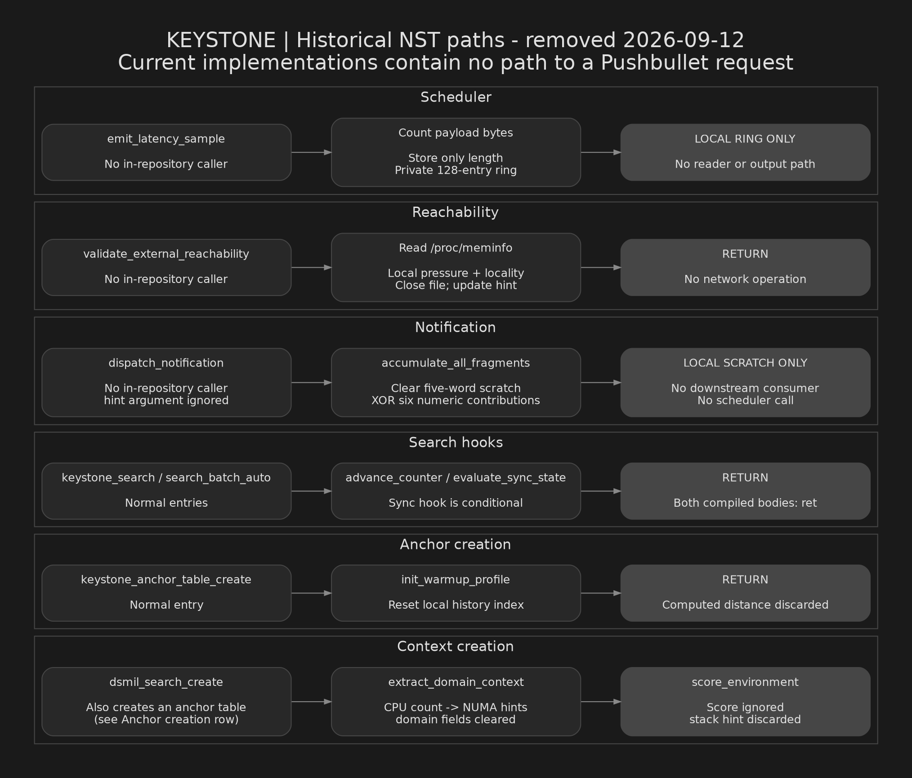

# KEYSTONE residual NST code paths — historical audit

**Removal status (2026-09-12):** The eight modules, headers, tuning build flag, and all source callers described below have been removed. This document and diagram preserve the pre-removal audit; source line numbers and binary hash refer to that earlier snapshot.

Reviewed 2026-09-12. Current helper implementations terminate in local memory, discarded results, or no-ops. No connection exists from domain hints to notification to scheduler to a Pushbullet request in the inspected code. Residual names and exported symbols remain.



Each row is a separate path. There are no connecting calls between rows except that `dsmil_search_create` also creates an anchor table, reaching the anchor-initialization row. “No in-repository caller” does not mean an exported function cannot be invoked externally. Node labels omit the `_nst_` subsystem prefixes for readability.

## Source evidence

| Path | Exact evidence and endpoint |
|---|---|
| Context creation | `src/dsmil_keystone_wrapper.c:45–48,75–79`: creates a zeroed stack-local hint, calls `_nst_hints_extract_domain_context`, then `_nst_hints_score_environment`; ignores the returned score and discards the hint. `src/nst_platform_hints.c:13–48`: CPU-count-derived synthetic NUMA matrix; domain confidence is zero and label empty. No domain lookup. |
| Anchor initialization | `src/keystone.c:1270–1272` calls `_nst_pfp_init_warmup_profile`. `src/nst_prefetch_profile.c:27–30`: resets a local history index and discards computed distance. |
| Search triggers | `src/keystone.c:1166–1174,2254–2262`: advance hook and conditionally invoked sync hook remain. `src/nst_prefetch_profile.c:33–39`: both ignore arguments and do nothing. Both compiled functions consist of `ret`. |
| Notification | `src/nst_vector_config.c:32–34`: `_nst_vcfg_dispatch_notification` ignores its hint and calls `_nst_vcfg_accumulate_all_fragments`. No in-repository caller of dispatcher was found. |
| Fragment accumulation | `src/nst_vector_config.c:21–29`: zeros five scratch words and invokes six numeric contribution helpers. No JSON construction, string decoding, scheduler call, or downstream scratch consumer. Scratch is exported, not private. |
| External reachability | `src/nst_memory_topology.c:24–46`: reads `/proc/meminfo`, closes it, computes local pressure/locality and updates caller-provided hint. No in-repository caller of this entry point was found. |
| Scheduler | `src/nst_batch_scheduler.c:14–26`: `_nst_sched_emit_latency_sample` counts payload bytes and writes only numeric length to a private 128-entry ring. No in-repository caller and no ring reader/output path. Counts bytes, not latency. |
| Build inclusion | `Makefile:6,107–111,141–146`: platform tuning enabled; NST sources remain linked into the library. Symbols remain exported. |

## Six fragment contributions

All contributors XOR numeric values into `scratch[0]`; the accumulator initializes the other four words to zero.

| Contributor | Value | Source |
|---|---|---|
| Prefetch | Computed prefetch distance | `src/nst_prefetch_profile.c:41–43` |
| Platform hints | Local synthetic NUMA node count | `src/nst_platform_hints.c:56–58` |
| Topology | `TOPO_VALIDATE` constant (`0x54473470U`) | `src/nst_memory_topology.c:7,49–53` |
| Alignment | Aligned/misaligned counters | `src/nst_cache_line_align.c:22–25` |
| Branch prediction | Low 16 bits of local history index | `src/nst_branch_predict.c:25–27` |
| DRAM locality | Local row-buffer byte shifted by 32 | `src/nst_dram_locality.c:15–17` |

The constant and fragment-related names warrant recognition as residual scaffolding; their current consumers do not reconstruct or transmit a credential.

## Compiled evidence

Inspected existing `libkeystone.so` SHA-256:

```text
1f63b59e99863d4b3a722f7a8b8e05a38a33a94c227535f0fd85fdf8207cac93
```

- Direct call/tail-call and relocation inspection agrees with the source paths above.
- No internal call reaches the scheduler or notification dispatcher.
- Named scheduler copies in 13 ELF artifacts contain no call or syscall instructions.
- The library `.init_array` points only to compiler-generated `frame_dummy`. `_init` has the conventional optional `__gmon_start__` profiling hook and no NST call.
- Repository-wide indicator searches covered 200 current files, including ignored artifacts, excluding `.git`. No Pushbullet endpoint, `Access-Token` header, `/v2/pushes`, or `Corp:` payload was found.
- Suspicious-import screening covered 48 ELF artifacts. This screening is not exhaustive binary verification.

## Proof boundary

The established claim is **no exfiltration path in these inspected current implementations**. This is static source/disassembly evidence, not a formal whole-program proof. Exported functions and global scratch can be accessed by external native callers; ELF symbol interposition, modified libraries, arbitrary external dependencies, and other installed copies are outside this claim. Non-NST source received broad indicator searches and selected reads, not a full line-by-line semantic audit. Git history and runtime behavior were not inspected. No application code was executed.

The scheduler's length loop tests the byte before the 4096 limit; this review does not certify memory safety or general correctness of residual helpers.

## Reproduce the key checks

Run from the repository root; these commands inspect data without loading the application library:

```sh
rg --threads 4 --hidden --no-ignore -n '_nst_|domain_label|domain_confidence' src include -g '!simdjson*'
rg --threads 4 --hidden --no-ignore -n 'pushbullet|Corp:|Access-Token|/v2/pushes' -g '!.git' -g '!docs/keystone-nst-flow.*' .
objdump -d --disassemble=_nst_sched_emit_latency_sample libkeystone.so
objdump -d --disassemble=_nst_pfp_advance_counter libkeystone.so
objdump -d --disassemble=_nst_pfp_evaluate_sync_state libkeystone.so
readelf -rW libkeystone.so
readelf -x .init_array libkeystone.so
sha256sum libkeystone.so
```

## Artifact generation

The PNG was rendered deterministically with Graphviz from [keystone-nst-flow.dot](keystone-nst-flow.dot). Colors were loaded from `/opt/sword-cyber/dark/sword_cyber_dark.json`; no generative image model was used. Regenerate with:

```sh
dot -Tpng -Gdpi=150 docs/keystone-nst-flow.dot -o docs/keystone-nst-flow.png
```
